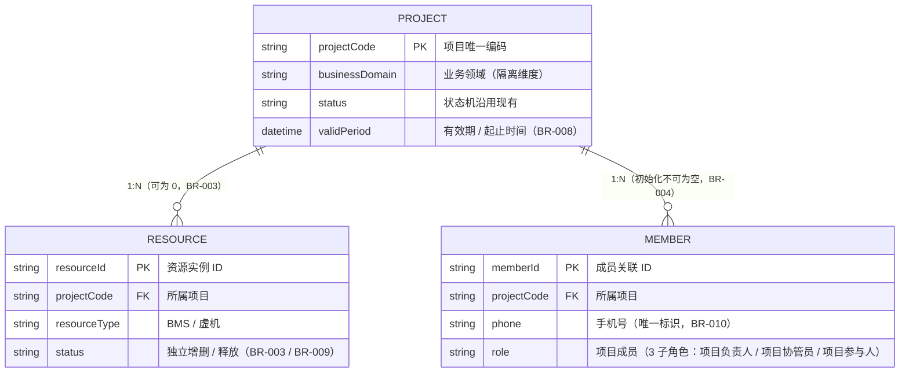
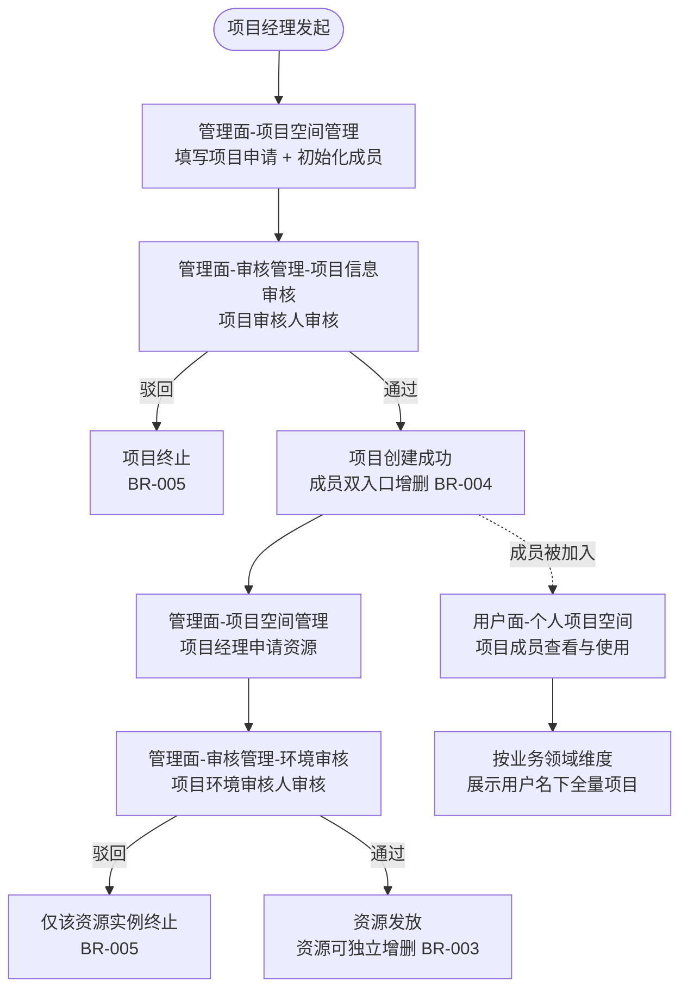

# 业务需求说明书

## 目录

1. [业务背景](#1-业务背景)
   1.1 [项目背景与痛点](#11-项目背景与痛点)
   1.2 [业务目标](#12-业务目标)
   1.3 [业务范围](#13-业务范围)
   1.4 [成功标准](#14-成功标准)
2. [业务逻辑设计](#2-业务逻辑设计)
   2.1 [业务实体与关系（仅参考）](#21-业务实体与关系仅参考)
   2.2 [主干流程](#22-主干流程)
   2.3 [业务规则](#23-业务规则)
3. [权限设计](#3-权限设计)
   3.1 [权限模型](#31-权限模型)
   3.2 [角色清单](#32-角色清单)
   3.3 [权限矩阵](#33-权限矩阵)
   3.4 [职责分离矩阵（SOD）](#34-职责分离矩阵sod)
4. [菜单入口规划](#4-菜单入口规划)
   4.1 [管理面](#41-管理面)
   4.2 [用户面](#42-用户面)
   4.3 [菜单与角色映射总表](#43-菜单与角色映射总表)
5. [数据迁移说明](#5-数据迁移说明)
   5.1 [迁移必要性](#51-迁移必要性)
   5.2 [验收要求](#52-验收要求)

---

## 1. 业务背景

### 1.1 项目背景与痛点

平台"技术合作"用户面原本是一条端到端流程：项目申请 → 审批 → 资源发放 → 成员管理 → 交付。该流程设计通用性较强——支持 BMS / 虚拟机资源发放、OBS 文件共享配置，以及成员按权限管理，因此被反复借用于承载临时大型活动（例如活动大赛支撑、KADC 等大型展会），导致真正的技术合作项目与非技术合作项目混在同一条流程中运行，项目数据、操作日志与权限边界相互交织，难以按业务维度清晰区分。

由此引出 4 类痛点：

| 痛点            | 表现                                        |
| ------------- | ----------------------------------------- |
| 业务数据与公共支撑能力耦合 | 公共项目/活动和技术合作项目共用数据表、审批流、权限模型              |
| 新业务接入成本高      | 每接入一个新场景，要么复制一套流程，要么深侵入技术合作代码；复用率低，迭代互相牵制 |
| 运营负担          | 临时活动频繁借道，平台管理负担越来越重                       |
| 后续扩展性受限       | 缺一套"项目 + 成员 + 资源"的公共流程接口，新业务接入没有基线可依      |

### 1.2 业务目标

把"项目 + 成员 + 资源"三条主能力的规则、流程、权限模型从技术合作里抽出来，做成业务无感知的公共流程基线：

- **首期承载业务领域"公共项目/活动"**
- **新业务接入基线**：后续业务场景基于基线快速接入，验收人天 ≤ 15

### 1.3 业务范围

本期涉及的业务领域共 3 个，按本期处理动作分为两类：

| 业务领域    | 现状            | 本期处理     |
| ------- | ------------- | -------- |
| 技术合作    | 现有"技术合作"用户面   | 不动       |
| 高校科研合作  | 现有"高校科研合作"用户面 | 不动       |
| 公共项目/活动 | 借道"技术合作"用户面   | 迁至新建公共流程 |

### 1.4 成功标准

| 编号     | 指标      | 目标                                           |
| ------ | ------- | -------------------------------------------- |
| SC-001 | 业务数据隔离  | 公共项目/活动数据按 `businessDomain` 与技术合作数据隔离可查，互不串扰 |
| SC-002 | 双轨并行    | 公共流程上线后，技术合作业务流程行为与用户体验零变更、零中断               |
| SC-003 | 新业务接入效率 | 新业务接入公共流程 ≤ 15 人天                            |
| SC-004 | 公共流程标准化 | 公共流程形成稳定的接口契约与业务规则基线，可承载 ≥ 3 个后续业务场景         |
| SC-005 | 用户面统一入口 | 用户面提供"个人项目空间"统一视图，按业务领域组织                    |

---

## 2. 业务逻辑设计

### 2.1 业务实体与关系（仅参考）

项目是聚合根，资源和成员都挂在 `projectCode` 下。项目可独立存在，不强制拥有资源；成员初始化时不可为空（BR-004）。`businessDomain` 是隔离维度，贯穿权限过滤、用户面视图和数据迁移（见 BR-001 / BR-006 / BR-007）。

### 2.2 主干流程

### 2.3 业务规则

| 编号         | 规则                                                                                                               | 触发条件                                        | 预期结果                                               | 异常处理                              |
| ---------- | ---------------------------------------------------------------------------------------------------------------- | ------------------------------------------- | -------------------------------------------------- | --------------------------------- |
| **BR-001** | 管理面 4 类角色按业务领域作用域授权；用户面 3 类子角色按单项目作用域授权；未授权作用域不可操作                                                               | 用户访问任意菜单 / 接口                               | 系统按用户被授权的作用域列表过滤可见项目、资源、菜单                         | 未授权作用域不展示                         |
| **BR-002** | 项目业务管理员在被授权业务领域内对项目拥有等同项目经理的最高权限                                                                                 | 项目业务管理员进入被授权业务领域                            | 可对领域内任意项目进行申请、编辑、删除、增删成员、申请资源等所有项目经理操作             | 无审核权（SOD 保证）                      |
| **BR-003** | 资源必须挂载在项目下；一个项目可拥有多份资源；资源相互独立，可独立增删                                                                              | 项目创建后                                       | 资源的申请、发放、释放均针对单一资源实例                               | 单个资源被驳回 / 释放不影响项目与其他资源            |
| **BR-004** | 3 类用户面子角色在项目创建时由项目经理在管理面初始化（不可为空）；项目创建后增删支持**双入口并行**：①用户面（项目负责人 / 项目协管员按权限分层管理）；②管理面（项目经理本人申请范围 / 项目业务管理员全量）     | 项目创建时 / 项目存续期间                              | 成员列表可任意调整；被加入成员在用户面"个人项目空间"中可见该项目                  | 删除成员时若已建立资源访问权限一并回收               |
| **BR-005** | 项目信息审核驳回 → 项目终止；环境审核驳回 → 仅该资源实例终止                                                                                | 项目审核人 / 项目环境审核人驳回                           | 项目驳回：项目终止，无资源入口；资源驳回：仅该资源实例终止                      | 驳回后项目经理可重新发起申请                    |
| **BR-006** | 数据迁移：现有"技术合作"流程中属于"公共项目/活动"业务的项目主数据迁移至公共流程                                                                       | 上线前一次性迁移                                    | 迁移后技术合作流程中不再保留"公共项目/活动"类项目；用户"个人项目空间"中可正常看到迁移过来的项目 | 迁移方式、脚本、时机、回滚预案由后端 SE 设计          |
| **BR-007** | 用户面"个人项目空间"展示用户被加入的全量项目，按 `businessDomain` 维度并列展示；"技术合作" / "高校科研合作"是一级菜单，对应业务领域的筛选视图；"公共项目/活动"不作为用户面一级菜单（内部运营性质） | 项目成员访问用户面                                   | 用户进入"个人项目空间"看到名下所有项目；通过顶部"技术合作"菜单可快速过滤到对应领域项目      | 跨业务领域项目在"个人项目空间"中以业务领域标签 / Tab 区分 |
| **BR-008** | 项目生命周期：项目有有效期；到期或业务结束后由项目经理 / 项目业务管理员关闭 / 归档                                                                     | 项目到期 / 业务结束 / 主动关闭                          | 项目置为关闭 / 归档态；其下资源按 BR-009 回收                       | 沿用现有流程                            |
| **BR-009** | 资源释放：运行中的资源可由项目经理 / 项目业务管理员释放；释放针对单一资源实例                                                                         | 资源不再需要 / 项目关闭                               | 资源置为"已释放"态，底层资源回收                                  | 沿用现有流程                            |
| **BR-010** | 成员开通与唯一性：成员以手机号为唯一标识加入项目；同一手机号在同一项目内不可重复添加                                                                       | 项目负责人 / 项目协管员（用户面）/ 项目经理 / 项目业务管理员（管理面）新增成员 | 校验手机号唯一性后建立成员关联；被加入成员在"个人项目空间"可见该项目                | 重复手机号：提示"成员已存在"，不重复创建             |
| **BR-011** | 容量配额：每个项目的文件存储（OBS）设有容量配额（沿用现有）；上传超额时阻止并提示                                                                       | 3 类用户面子角色上传文件                               | 上传被拒绝并提示剩余 / 总配额                                   | 沿用现有配额数值                          |

---

## 3. 权限设计

### 3.1 权限模型

核心模型用 **RBAC + 业务领域作用域属性**：

- 角色（Role）定义功能权限（菜单 / 操作）
- 业务领域（Business Domain）作为属性维度叠加在角色授权上
- 一个用户可被授予"角色 + 业务领域"的多重组合

数据级权限按 `businessDomain` 在查询层强制过滤。

职责分离（SOD）硬约束：

- 项目经理 ↔ 项目审核人互斥：同一项目的申请人与审核人不能为同一人
- 项目业务管理员无审核权

详细 SOD 矩阵见 3.4。

### 3.2 角色清单

| 角色              | 业务领域作用域        | 适用人群   | 核心职责                                                         |
| --------------- | -------------- | ------ | ------------------------------------------------------------ |
| **管理面**         |                |        |                                                              |
| 项目经理            | 单 / 多业务领域（按授权） | 内部业务人员 | 在被授权业务领域内申请项目、申请资源；在管理面管理本项目成员（设定项目负责人 / 协管员）                |
| 项目审核人           | 单 / 多业务领域（按授权） | 内部业务人员 | 审核被授权业务领域内的项目                                                |
| 项目环境审核人         | 单 / 多业务领域（按授权） | 内部业务人员 | 审核被授权业务领域内的资源环境                                              |
| 项目业务管理员         | 单 / 多业务领域（按授权） | 内部业务人员 | 在被授权业务领域内对全量项目拥有等同项目经理的最高管理权限（无审核权）                          |
| **用户面（项目内子角色）** |                |        |                                                              |
| 项目负责人           | 单项目（被加入即获授权）   | 外网项目成员 | 项目侧的对外责任人；**用户面成员管理**（可增删自己外所有成员，含设置项目协管员、添加新项目负责人）；一个项目可有多个 |
| 项目协管员           | 单项目（被加入即获授权）   | 外网项目成员 | 协助项目负责人；**用户面成员管理**（可增删项目负责人和自己外所有成员）                        |
| 项目参与人           | 单项目（被加入即获授权）   | 外网项目成员 | 用户面"个人项目空间"查看与使用，不参与成员管理                                     |

**现状角色 → 公共流程归属映射**：

| 现状角色                       | 公共流程归属                       | 说明                                 |
| -------------------------- | ---------------------------- | ---------------------------------- |
| 项目经理                       | 项目经理                         | 语义沿用，叠加业务领域作用域；与"项目负责人"做内/外区分      |
| 合作经理                       | 项目审核人                        | "合作"剥离技术合作场景语义                     |
| 环境审核人                      | 项目环境审核人                      | 语义沿用，叠加业务领域作用域                     |
| 业务管理员                      | 项目业务管理员                      | 语义沿用，叠加业务领域作用域                     |
| 高校教师 / 学生管理员 / 高校学生 / 华为人员 | 项目负责人 / 项目协管员 / 项目参与人（3 子角色） | 公共流程成员侧收敛为 3 子角色；原"华为人员"按"项目参与人"对待 |

### 3.3 权限矩阵

| 功能 \ 角色              | 项目经理    | 项目审核人 | 项目环境审核人 | 项目业务管理员 | 项目成员（3 子角色）                                 |
| -------------------- |:-------:|:-----:|:-------:|:-------:|:-------------------------------------------:|
| **管理面 - 项目空间管理**     |         |       |         |         |                                             |
| 申请项目                 | 是       | 否     | 否       | 是       | 否                                           |
| 管理项目（编辑 / 关闭 / 归档）   | 是（本人申请） | 否     | 否       | 是（全量）   | 否                                           |
| 项目成员增删               | 是（本人申请） | 否     | 否       | 是（全量）   | 项目负责人：是（除自己外）/ 项目协管员：是（除项目负责人和自己外）/ 项目参与人：否 |
| 申请资源                 | 是（本人申请） | 否     | 否       | 是（全量）   | 否                                           |
| 管理资源（编辑 / 释放）        | 是（本人申请） | 否     | 否       | 是（全量）   | 否                                           |
| **管理面 - 审核管理**       |         |       |         |         |                                             |
| 项目信息审核（查看 / 通过 / 驳回） | 否       | 是     | 否       | 否       | 否                                           |
| 环境审核（查看 / 通过 / 驳回）   | 否       | 否     | 是       | 否       | 否                                           |
| **用户面 - 个人项目空间**     |         |       |         |         |                                             |
| 查看被加入项目              | 否       | 否     | 否       | 否       | 是                                           |
| 使用项目内资源              | 否       | 否     | 否       | 否       | 是                                           |
| 文件查看 / 下载            | 否       | 否     | 否       | 否       | 是                                           |
| 文件上传 / 删除（BR-011）    | 否       | 否     | 否       | 否       | 是                                           |

### 3.4 职责分离矩阵（SOD）

| 互斥对               | 互斥规则                                 |
| ----------------- | ------------------------------------ |
| 项目经理 ↔ 项目审核人      | 同一项目的申请人与该项目的项目审核人不能为同一物理用户          |
| 项目经理 ↔ 项目环境审核人    | 同一资源的申请人与该资源的项目环境审核人不能为同一物理用户        |
| 项目业务管理员 ↔ 项目审核人   | 项目业务管理员在本业务领域内无审核权（虽不直接互斥，但通过权限隔离保证） |
| 项目业务管理员 ↔ 项目环境审核人 | 同上                                   |

---

## 4. 菜单入口规划

### 4.1 管理面

| 菜单路径   | 菜单名              | 操作角色           | 业务领域作用域    | 聚合功能                             |
| ------ | ---------------- | -------------- | ---------- | -------------------------------- |
| 一级菜单   | 公共项目/活动 - 项目空间管理 | 项目经理 / 项目业务管理员 | 自身被授权的业务领域 | 项目申请 / 项目管理 / 资源申请 / 资源管理 / 成员管理 |
| 一级菜单   | 公共项目/活动 - 审核管理   | —              | —          | 父菜单                              |
| ├─ 子菜单 | · 项目信息审核         | 项目审核人          | 自身被授权的业务领域 | 项目审核（通过 / 驳回）                    |
| └─ 子菜单 | · 环境审核           | 项目环境审核人        | 自身被授权的业务领域 | 资源环境审核（通过 / 驳回）                  |

### 4.2 用户面

新增 1 个入口"个人项目空间"，与已有"技术合作"、"高校科研合作"两个一级菜单并列。"个人项目空间"展示用户被加入的全量项目（含技术合作、高校科研合作、公共项目/活动三个业务领域），按 `businessDomain` 维度并列展示；"技术合作" / "高校科研合作"两个一级菜单则是这份数据上对应业务领域的筛选视图。

| 菜单路径     | 菜单名    | 操作角色        | 业务领域作用域       |
| -------- | ------ | ----------- | ------------- |
| 一级菜单（新增） | 个人项目空间 | 项目成员（3 子角色） | 跨业务领域（被加入的项目） |
| 一级菜单（已有） | 技术合作   | 项目成员（3 子角色） | 单业务领域（技术合作）   |
| 一级菜单（已有） | 高校科研合作 | 项目成员（3 子角色） | 单业务领域（高校科研合作） |

几个设计要点：

- 项目主表共用一份，`businessDomain` 字段标识业务领域归属
- 公共项目/活动不作为用户面一级菜单——内部运营性质，不对外暴露独立入口（BR-007）
- "个人项目空间"是统一聚合视图，"技术合作" / "高校科研合作"是它的业务领域筛选切片

### 4.3 菜单与角色映射总表

| 平台  | 菜单            | 角色             | 业务领域作用域       |
| --- | ------------- | -------------- | ------------- |
| 管理面 | 项目空间管理        | 项目经理 / 项目业务管理员 | 自身被授权的业务领域    |
| 管理面 | 审核管理 / 项目信息审核 | 项目审核人          | 自身被授权的业务领域    |
| 管理面 | 审核管理 / 环境审核   | 项目环境审核人        | 自身被授权的业务领域    |
| 用户面 | 个人项目空间（新增）    | 项目成员（3 子角色）    | 单项目（被加入）      |
| 用户面 | 技术合作（已有，不动）   | 项目成员（3 子角色）    | 单业务领域（技术合作）   |
| 用户面 | 高校科研合作（已有，不动） | 项目成员（3 子角色）    | 单业务领域（高校科研合作） |

---

## 5. 数据迁移说明

### 5.1 迁移必要性

"公共项目/活动"业务长期借道"技术合作"用户面，存在历史项目数据（含已建立的项目、成员、资源关系）需要统一迁入公共流程。目的有两个：

- 公共流程上线后，"个人项目空间"中能正常展示历史项目
- 技术合作用户面不再混入"公共项目/活动"类项目，避免双轨运行期间数据重复 / 状态不一致

### 5.2 验收要求

迁移完成后要验证：

- "个人项目空间"中迁移项目的业务领域标签 = 公共项目/活动
- 技术合作一级菜单中不再展示被迁移的项目
- 迁移项目下的成员 / 资源关系完整保留
- 迁移项目的状态、关键属性与迁移前一致
