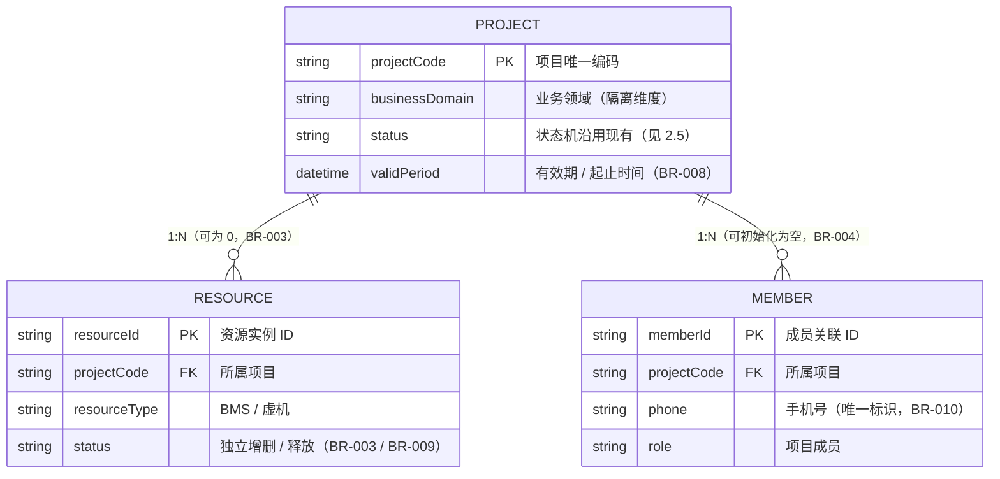
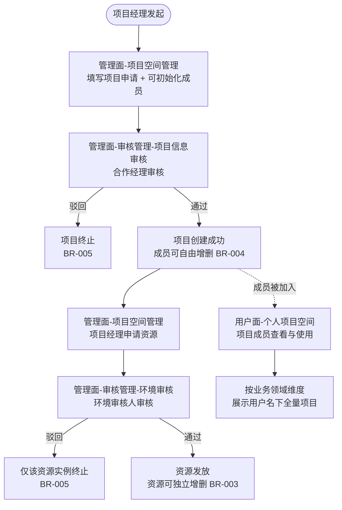

# 业务需求说明书

> **项目名称**：公共项目/活动 业务承载与流程抽取
> **文档版本**：v1.3
> **文档状态**：待评审（v1.3 基于用户评审反馈修订：回退 SC-001 隔离细节、删除 2.5/2.6、BR-008~011 标注待复核；详见文末变更记录）
> **文档范围**：仅含业务需求（流程 / 规则 / 角色权限 / 菜单 / 验收）
> **不涵盖**：前端技术方案、后端设计、API 契约、数据库设计、隔离实现、迁移脚本

---

## 目录

1. [业务背景](#1-业务背景)
2. [业务逻辑设计](#2-业务逻辑设计)
3. [权限设计](#3-权限设计)
4. [菜单入口规划](#4-菜单入口规划)
5. [数据迁移说明](#5-数据迁移说明)
6. [验收标准](#6-验收标准)
7. [范围与假设](#7-范围与假设)
8. [附录：术语表](#8-附录术语表)

---

## 1. 业务背景

### 1.1 项目起源

当前 `hidevlabservice` 平台的"技术合作"用户面是面向生态对外技术合作场景（KADC 活动、高校研究等）的端到端流程，承载"项目申请 → 项目审批 → 资源发放 → 成员开通 → 交付"完整链路。

随着平台对内运营能力扩展，"**公共项目/活动**"类业务（内部活动大赛、内部运营活动等）也借道该用户面实现。**两类业务的资源、成员、审批数据共用同一套底层支撑**，业务数据与公共支撑能力深度耦合。

### 1.2 痛点

| 痛点 | 表现 |
|---|---|
| **业务数据与公共支撑能力耦合** | "公共项目/活动"类项目与技术合作项目共享数据表 / 审批流 / 权限模型，统计、对账、归档均需按业务域手工过滤 |
| **新业务接入成本高** | 每接入一个新业务场景需"复制一套"或深侵入技术合作代码，复用率低，迭代互相牵制 |
| **运营负担** | 内部活动频繁借道技术合作用户面，平台管理员需在两套语义间切换，系统管理负担持续增长 |
| **后续扩展性受限** | 缺少标准化的"项目 + 成员 + 资源"公共流程接口，未来更多业务场景接入无统一基线 |

### 1.3 业务目标

将"项目 + 成员 + 资源"三条主能力的**业务规则、流程、权限模型**从技术合作业务中**抽离**为业务无感知的公共流程基线：

1. **首期承载"公共项目/活动"业务**作为公共流程的第一个业务场景。
2. 与"技术合作"业务流程**双轨并行**，互不影响。
3. 后续业务场景可通过该公共流程基线**快速接入**，新业务接入人天 ≤ 15。

### 1.4 成功标准

| 编号 | 指标 | 目标值 |
|---|---|---|
| SC-001 | 业务数据隔离 | "公共项目/活动"业务数据与技术合作业务数据**按业务领域（`businessDomain`）隔离可查**，互不串扰 |
| SC-002 | 双轨并行 | 公共流程上线后，技术合作业务流程**零变更、零中断** |
| SC-003 | 新业务接入效率 | 新业务接入公共流程**≤ 15 人天**（基线目标） |
| SC-004 | 公共流程标准化 | 公共流程形成**稳定接口契约与业务规则基线**，可承载 ≥ 3 个后续业务场景 |
| SC-005 | 用户面统一入口 | 用户面提供"个人项目空间"统一项目视图，按业务领域维度组织 |

### 1.5 干系人

| 角色 | 职责 | 涉及阶段 |
|---|---|---|
| 业务方（公共项目/活动运营） | 业务规则确认、UAT 验收 | 需求 / 验收 |
| 业务方（技术合作运营） | 双轨并行影响确认 | 需求 / 验收 |
| 产品 / SE | 业务需求撰写与方案设计 | 需求 / 方案 |
| 后端 SE / 开发 | 公共流程后端实现、迁移方案 | 实现（不在本方案范围） |
| 前端 SE / 开发 | 公共流程前端实现（用户面 + 管理面菜单接入） | 实现（不在本方案范围） |
| 测试 | UAT / 业务验收 | 验收 |

---

## 2. 业务逻辑设计 ⭐

### 2.1 业务实体与关系

- **项目（Project）**：独立存在的业务实体；可独立存在，不强制拥有资源
- **资源（Resource）**：必须挂载在项目下；一个项目可拥有多份资源
- **项目成员（Member）**：N 名成员与项目关联；成员身份是"项目成员"角色的来源

**图说**：项目是独立聚合根，资源与成员均以 `projectCode` 挂载；二者基数均为 0..N（项目可无资源、可无成员）。`businessDomain` 是项目的隔离维度属性，贯穿权限过滤、用户面视图与数据迁移（BR-001 / BR-006 / BR-007）。

### 2.2 主干流程

### 2.3 业务规则清单

| 编号 | 规则描述 | 触发条件 | 预期结果 | 异常处理 |
|---|---|---|---|---|
| **BR-001** | 所有 5 类角色均按**业务领域作用域**授权；未授权的业务领域**不可见、不可操作** | 用户访问任意菜单 / 接口 | 系统按用户被授权的业务领域列表过滤可见项目 / 资源 / 菜单 | 未授权领域完全不展示，无"无权限"提示（避免泄露领域存在） |
| **BR-002** | 业务管理员在其被授权的业务领域内，对项目拥有**等同项目经理**的最高权限 | 业务管理员进入其被授权的业务领域 | 业务管理员可对该领域内任意项目进行申请 / 编辑 / 删除 / 增删成员 / 申请资源等所有项目经理操作 | 业务管理员**无审核权限**（审核仍由合作经理 / 环境审核人执行，职责分离） |
| **BR-003** | 资源必须挂载在项目下，**一个项目可拥有多份资源**；资源相互独立，可独立增删 | 项目创建后 / 项目存在期间 | 资源申请 / 发放 / 释放均针对单一资源实例 | 单个资源被驳回 / 释放不影响项目与其他资源 |
| **BR-004** | 项目成员在项目创建时**可初始化**（也可为空）；项目创建后由**项目经理 / 业务管理员**自由增删 | 项目创建时 / 项目存续期间 | 成员列表可任意调整；被加入的成员在用户面"个人项目空间"中可见该项目 | 删除成员时，若该成员已建立资源访问权限，**一并回收**（具体回收策略由后端 SE 设计） |
| **BR-005** | **项目信息审核驳回 → 项目终止**，不进入资源申请环节；**环境审核驳回 → 仅该资源实例终止**，不影响项目与其他资源 | 合作经理 / 环境审核人执行驳回操作 | 项目驳回：项目状态置为终止，无资源入口；资源驳回：仅该资源实例置为终止 | 驳回意见由审核人填写；驳回后可由项目经理重新发起申请 |
| **BR-006** | 数据迁移：将现有"技术合作"流程中属于"公共项目/活动"业务的项目主数据（项目 / 成员 / 资源）迁移至公共流程 | 本期上线前一次性迁移 | 迁移完成后，技术合作流程中不再保留"公共项目/活动"类项目；用户在"个人项目空间"中可正常看到迁移过来的项目 | 迁移方式、脚本、时机、回滚预案由后端 SE 自行设计 |
| **BR-007** | **用户面数据视图统一**：用户面"个人项目空间"展示该用户被加入的**全量项目**，按 `businessDomain` 维度并列展示；"技术合作"一级菜单为同一份数据上的**业务领域筛选视图**（仅展示 `businessDomain = TECH_COOP` 的项目）；"公共项目/活动"**不作为用户面一级菜单** | 项目成员访问用户面 | 用户进入"个人项目空间"看到名下所有项目（含技术合作 + 公共项目/活动）；通过顶部"技术合作"菜单可快速过滤到技术合作领域项目 | 跨业务领域项目在"个人项目空间"中以"业务领域"标签 / Tab 区分 |
| **BR-008** *(待业务方/后端复核)* | **项目生命周期**：项目具有有效期（起止时间）；到期或业务结束后，由项目经理 / 业务管理员**关闭 / 归档**项目；状态枚举沿用现有（如"进行中 / 已下架"，A-7） | 项目到期 / 业务结束 / 主动关闭 | 项目置为关闭 / 归档态；其下资源按 BR-009 回收；成员在"个人项目空间"中的可见性沿用现有规则 | 关闭后是否可重新激活：沿用现有流程，本方案不新增 |
| **BR-009** *(待业务方/后端复核)* | **资源释放**：运行中的资源可由项目经理 / 业务管理员**释放**；释放针对单一资源实例，不影响项目与其他资源（呼应 BR-003） | 资源不再需要 / 项目关闭 | 资源置为"已释放"态，底层资源回收（回收策略由后端 SE 设计） | 释放是否需审核：沿用现有流程，本方案不新增审核环节 |
| **BR-010** *(待业务方/后端复核)* | **成员开通与唯一性**：成员以**手机号**为唯一标识加入项目；同一手机号在同一项目内**不可重复添加**；未注册手机号的外网账号开通 / 绑定沿用现有机制 | 项目经理 / 业务管理员新增成员 | 校验手机号唯一性后建立成员关联；被加入成员在"个人项目空间"可见该项目 | 重复手机号：提示"成员已存在"，不重复创建关联 |
| **BR-011** *(待业务方/后端复核)* | **容量配额**：每个项目的文件存储（OBS）设有**容量配额**（沿用现有，具体数值待业务方/后端评估）；上传超额时阻止并提示 | 项目成员上传文件 | 校验"已用容量 + 本次大小 ≤ 配额"，否则拒绝上传 | 配额是否按业务领域差异化（大型活动可能需更高配额）：待澄清-6 |

### 2.4 边界条件与异常场景

| 场景 | 业务行为 |
|---|---|
| 项目经理跨业务领域申请项目 | 只能在自身被授权的业务领域内发起；目标领域未授权时**提交按钮置灰 / 入口不可见** |
| 合作经理被授予多业务领域 | 审核列表展示**多领域待审项目合并视图**或**按领域切换 Tab**（由前端实现，本方案不约束具体形态） |
| 业务管理员仅被授予单业务领域 | 仅能管理该领域内全量项目；其他领域项目**完全不可见** |
| 资源申请被驳回后再次申请 | 项目经理可对同一项目重新发起资源申请；**视为新资源实例**，不与历史驳回实例关联 |
| 成员被加入项目但 `businessDomain` 与项目经理不同 | 不影响成员身份；成员在"个人项目空间"中按自身被加入的所有项目维度展示 |
| 项目已创建但长期无资源 | 允许存在；不强制要求项目必须配套资源（BR-003 反向） |

---

## 3. 权限设计

### 3.1 权限模型选型

- **核心模型**：**RBAC + 业务领域作用域属性**
  - 角色（Role）定义功能权限（菜单 / 操作）
  - 业务领域（Business Domain）作为**属性维度**叠加在角色授权上
  - 一个用户可被授予 **"角色 + 业务领域"** 的多重组合
- **数据级权限**：按 `businessDomain` 在数据查询层强制过滤
- **职责分离（SOD）**：
  - 项目经理 ↔ 合作经理（**互斥**）：同一项目的申请人与审核人不能为同一人
  - 业务管理员无审核权（见 BR-002）

### 3.2 角色清单

| 角色 | 业务领域作用域 | 适用人群 | 核心职责 |
|---|---|---|---|
| **项目经理** | **单/多业务领域**（按授权） | 内部业务人员 | 在被授权业务领域内申请项目、申请资源、管理本项目成员 |
| **合作经理** | **单/多业务领域**（按授权） | 内部业务人员 | 审核其被授权业务领域内的项目 |
| **环境审核人** | **单/多业务领域**（按授权） | 内部业务人员 | 审核其被授权业务领域内的资源环境 |
| **业务管理员** | **单/多业务领域**（按授权） | 内部业务人员 | 在被授权业务领域内对全量项目拥有等同项目经理的最高管理权限 |
| **项目成员** | **单项目**（被加入即获授权） | 外网项目成员 | 通过用户面"个人项目空间"查看并使用其被加入的项目及资源 |

> **关键约束（BR-001）**：所有 5 类角色均按业务领域作用域授权，未授权领域完全不可见、不可操作。

> **现状角色对照与映射（基于线上"技术合作"真实流程核对）**
>
> 线上技术合作流程的角色现状为——联系人 / 管理侧：**项目经理、合作经理、项目专家**（项目概述接口返回的三类联系人）；成员侧子角色：**高校教师、高校学生、学生管理员、华为人员**（新增成员时可选）。与本公共流程角色模型的映射如下：
>
> **⚠️ 下表内容为 Claude 基于实际观察的映射建议，需业务方（技术合作运营 + 公共项目/活动运营）评审时复核。**

| 现状角色 | 公共流程归属 | 说明 |
|---|---|---|
| 项目经理 | 项目经理 | 语义沿用，叠加"业务领域作用域" |
| 合作经理 | 合作经理 | 语义沿用，承担项目信息审核 |
| 项目专家 | （不纳入权限模型） | 现状为**联系人展示属性**，作为项目元数据字段保留，非权限角色（A-12） |
| —（新增） | 环境审核人 | 公共流程**新增**审核角色；现状环境审核职责的承接人需明确（待澄清-7） |
| —（新增） | 业务管理员 | 公共流程**新增**领域级管理角色 |
| 高校教师 / 高校学生 / 学生管理员 / 华为人员 | 项目成员 | 公共流程**统一收敛**为单一"项目成员"（A-11）；技术合作双轨保留原子角色 |

### 3.3 权限矩阵

| 功能 \ 角色 | 项目经理 （作用域：被授权领域） | 合作经理 （作用域：被授权领域） | 环境审核人 （作用域：被授权领域） | 业务管理员 （作用域：被授权领域） | 项目成员 （作用域：单项目） |
|---|:---:|:---:|:---:|:---:|:---:|
| **管理面-项目空间管理** | | | | | |
| 申请项目 | ✅ | ❌ | ❌ | ✅ | ❌ |
| 管理项目（编辑 / 关闭 / 归档，BR-008） | ✅（本人申请） | ❌ | ❌ | ✅（全量） | ❌ |
| 项目成员增删（BR-004 / BR-010） | ✅（本人申请） | ❌ | ❌ | ✅（全量） | ❌ |
| 申请资源 | ✅（本人申请） | ❌ | ❌ | ✅（全量） | ❌ |
| 管理资源（编辑 / 释放，BR-009） | ✅（本人申请） | ❌ | ❌ | ✅（全量） | ❌ |
| **管理面-审核管理-项目信息审核** | | | | | |
| 查看待审项目 | ❌ | ✅ | ❌ | ❌ | ❌ |
| 审核通过 / 驳回 | ❌ | ✅ | ❌ | ❌ | ❌ |
| **管理面-审核管理-环境审核** | | | | | |
| 查看待审资源 | ❌ | ❌ | ✅ | ❌ | ❌ |
| 审核通过 / 驳回 | ❌ | ❌ | ✅ | ❌ | ❌ |
| **用户面-个人项目空间** | | | | | |
| 查看被加入项目 | ❌（非成员） | ❌ | ❌ | ❌（非成员） | ✅ |
| 使用项目内资源（Web 接入 / IDE） | ❌ | ❌ | ❌ | ❌ | ✅ |
| 查看 / 下载项目文件 | ❌ | ❌ | ❌ | ❌（非成员） | ✅ |
| 上传 / 删除项目文件（受容量配额约束，BR-011） | ❌ | ❌ | ❌ | ❌（非成员） | ✅ |

> 说明：项目经理 / 业务管理员在**被授权业务领域**内拥有该领域相关功能权限；项目成员角色在**单项目**内拥有查看与使用权限。管理面角色（项目经理 / 合作经理 / 环境审核人 / 业务管理员）若需访问用户面项目文件 / 资源，须以"项目成员"身份被加入该项目（故上表用户面行对其标注"非成员"为 ❌）。

> **与现状的关键差异（成员管理位置）**：线上技术合作流程中，项目负责人（高校教师等"项目成员"）可在**用户面**自助增删项目成员；公共流程将成员增删**上收至管理面**（项目经理 / 业务管理员），用户面"项目成员"仅保留查看与使用。该调整改变大型活动的成员运营方式（自助 → 集中），需业务方确认（待澄清-9）。

### 3.4 职责分离矩阵（SOD）

| 互斥对 | 互斥规则 | 校验时机 |
|---|---|---|
| 项目申请人 ↔ 项目审核人 | 同一项目的申请人与该项目的合作经理**不能为同一物理用户** | 项目提交审核时 |
| 资源申请人 ↔ 环境审核人 | 同一资源的申请人与该资源的环境审核人**不能为同一物理用户** | 资源提交审核时 |
| 业务管理员 ↔ 合作经理（同一项目） | 业务管理员在本业务领域内**无审核权**（虽不直接互斥，但通过权限隔离保证） | 审核入口权限校验 |
| 业务管理员 ↔ 环境审核人（同一资源） | 同上 | 审核入口权限校验 |

---

## 4. 菜单入口规划

### 4.1 管理面（内网）—— 3 个新增菜单

| 菜单路径 | 菜单名 | 操作角色 | 业务领域作用域 | 聚合功能 |
|---|---|---|---|---|
| 一级菜单 | **公共项目/活动 - 项目空间管理** | 项目经理 / 业务管理员 | 自身被授权的业务领域 | 项目申请 / 项目管理 / 资源申请 / 资源管理 / 成员管理（子页签/子路由分流） |
| 一级菜单 | **公共项目/活动 - 审核管理** | — | — | 父菜单，承载两个子菜单 |
| ├─ 子菜单 | **· 项目信息审核** | 合作经理 | 自身被授权的业务领域 | 项目审核（通过 / 驳回） |
| └─ 子菜单 | **· 环境审核** | 环境审核人 | 自身被授权的业务领域 | 资源环境审核（通过 / 驳回） |

**菜单可见性规则**：
- "项目空间管理"对**项目经理 + 业务管理员**可见；可见的业务领域范围 = 用户被授予的项目经理/业务管理员角色所覆盖的业务领域
- "审核管理"对**合作经理 + 环境审核人**可见；子菜单按角色过滤
- 未被授予任何相关角色的用户，看不到上述任何菜单

### 4.2 用户面（外网）—— 1 个新增菜单 + 现有菜单关系

| 菜单路径 | 菜单名 | 操作角色 | 业务领域作用域 | 数据视图 |
|---|---|---|---|---|
| 一级菜单（**新增**） | **个人项目空间** | 项目成员 | 跨业务领域（被加入的项目） | 用户名下**全量项目**，按 `businessDomain` 维度并列展示（技术合作 / 公共项目/活动 等） |
| 一级菜单（**已有**） | 技术合作 | 项目成员 | 单业务领域（技术合作） | 同一份项目主表上 `businessDomain = TECH_COOP` 的子集 |

**关键设计点**：
- **数据底座统一**：项目主表一份，`businessDomain` 字段标识业务领域归属
- **公共项目/活动不作为用户面一级菜单**：因内部运营性质，不对外暴露独立入口（BR-007）
- **"个人项目空间"为统一聚合视图**，"技术合作"菜单为该视图上的一个业务领域筛选切片
- **个人项目空间内部布局沿用现有**，不再深化设计

### 4.3 菜单与角色映射总表

| 平台 | 菜单 | 角色 | 业务领域作用域 |
|---|---|---|---|
| 管理面 | 项目空间管理 | 项目经理 / 业务管理员 | 自身被授权的业务领域 |
| 管理面 | 审核管理 - 项目信息审核 | 合作经理 | 自身被授权的业务领域 |
| 管理面 | 审核管理 - 环境审核 | 环境审核人 | 自身被授权的业务领域 |
| 用户面 | 个人项目空间（新增） | 项目成员 | 单项目（被加入） |
| 用户面 | 技术合作（已有，不动） | 项目成员 | 单业务领域（技术合作） |

---

## 5. 数据迁移说明

### 5.1 迁移必要性

由于"公共项目/活动"业务长期借道"技术合作"用户面，存在历史项目数据（含已建立的项目、成员、资源关系）需统一迁入公共流程，以保证：

- 公共流程上线后，"个人项目空间"中可正常展示历史项目
- 技术合作用户面不再混入"公共项目/活动"类项目（避免双轨运行期间数据重复 / 状态不一致）

### 5.2 迁移范围

| 范围项 | 是否迁移 | 说明 |
|---|---|---|
| 项目主数据 | ✅ | 现有"技术合作"流程中 `businessDomain = 公共项目/活动` 的项目 |
| 成员关系 | ✅ | 项目与成员的关联关系 |
| 资源实例 | ✅ | 已发放的资源实例及基本属性 |
| 历史审批记录 | ❌ | 仅在原系统归档，不迁移至公共流程 |
| 历史审计日志 | ❌ | 同上 |
| 业务配置 | ⚪ | 不涉及迁移，公共流程使用自身业务配置 |

### 5.3 责任边界

- **业务侧（本方案）**：明确迁移范围、迁移前后业务一致性预期
- **后端 SE**：迁移方式（在线 / 离线 / 双写对账）、脚本设计、执行时机、回滚预案、灰度策略
- **业务方（公共项目/活动运营）**：迁移前的项目清单核对与确认

### 5.4 验收要求

迁移完成后需验证：
- "个人项目空间"中迁移项目的**业务领域标签 = 公共项目/活动**
- 技术合作一级菜单中**不再展示**被迁移的项目
- 迁移项目下的成员 / 资源关系**完整保留**
- 迁移项目的状态、关键属性**与迁移前一致**

---

## 6. 验收标准

### 6.1 核心验收用例

| 编号 | 场景 | 前置 | 主流程 | 预期结果 |
|---|---|---|---|---|
| **UC-001** | 项目经理申请项目并初始化成员 | 项目经理拥有"公共项目/活动"领域授权 | 进入管理面"项目空间管理" → 填写项目申请 → 初始化 2 名成员 → 提交 | 项目进入"待项目信息审核"状态；初始化成员出现在成员列表 |
| **UC-002** | 合作经理审核项目（通过 / 驳回） | UC-001 完成后，项目处于待审 | 进入管理面"审核管理 - 项目信息审核" → 选择"通过" / "驳回（带意见）" | 通过：项目状态变为"已创建"，可在"项目空间管理"中看到；驳回：项目状态变为"已终止"，无资源申请入口 |
| **UC-003** | 项目创建后增删成员 | UC-002 通过 | 进入"项目空间管理" → 成员管理 → 添加 1 名 / 删除 1 名 | 成员列表更新；被加入成员在"个人项目空间"中可见该项目；被删除成员的"个人项目空间"中该项目消失 |
| **UC-004** | 项目经理申请资源 | UC-002 通过，项目已创建 | 进入"项目空间管理" → 资源申请 → 填写资源信息 → 提交 | 资源进入"待环境审核"状态；项目下出现该资源条目 |
| **UC-005** | 环境审核人审核资源（通过 / 驳回） | UC-004 完成后，资源处于待审 | 进入"审核管理 - 环境审核" → 选择"通过" / "驳回" | 通过：资源状态变为"运行中"，项目下该资源可被成员使用；驳回：该资源状态变为"已终止"，项目及其他资源不受影响 |
| **UC-006** | 项目成员进入个人项目空间 | UC-002 通过，且当前用户为项目成员 | 用户面登录 → 进入"个人项目空间" | 看到该用户被加入的所有项目（含本项目及其他业务领域项目），按业务领域标签 / Tab 区分 |
| **UC-007** | 业务管理员对被授权业务领域全量项目管理 | 业务管理员拥有"公共项目/活动"领域授权 | 进入"项目空间管理" → 看到该领域全量项目 | 可对任意项目执行等同项目经理的操作（编辑 / 关闭 / 增删成员 / 申请资源 / 释放资源）；**无审核权限**（审核入口不可见） |
| **UC-008** | 角色未授权业务领域不可见不可操作 | 用户仅被授予"技术合作"领域，无"公共项目/活动"领域 | 尝试访问"公共项目/活动"相关菜单 | 管理面：相关菜单完全不可见；用户面"个人项目空间"中不展示该领域项目；如尝试直接访问 URL，返回"无权限"或重定向至首页 |
| **UC-009** | 项目经理 / 业务管理员释放资源 | UC-005 通过，资源处于"运行中" | 进入"项目空间管理" → 资源管理 → 选择资源 → 释放 | 该资源置为"已释放"，项目与其他资源不受影响；成员不再可使用该资源（BR-009） |
| **UC-010** | 项目到期 / 关闭 | 项目处于"已创建 / 运行中" | 项目经理 / 业务管理员关闭项目（或到期触发） | 项目置为关闭 / 归档态（枚举沿用现有）；其下资源按 BR-009 回收（BR-008） |
| **UC-011** | 新增重复手机号成员 | 项目已存在，某手机号已是其成员 | 成员管理 → 新增成员 → 填入已存在手机号 | 系统提示"成员已存在"，不重复创建关联；不同手机号正常加入并开通外网访问（BR-010） |
| **UC-012** | 文件上传触达容量配额 | 项目 OBS 已用量接近配额 | 项目成员上传超过剩余配额的文件 | 上传被拒绝并提示剩余 / 总配额；配额内上传正常（BR-011） |

### 6.2 业务验收指标

| 指标 | 目标 | 验证方式 |
|---|---|---|
| 业务领域隔离有效率 | 100%（无跨领域数据泄露） | UC-008 验证；数据查询日志审计 |
| 双轨并行无干扰 | 100%（技术合作业务流程零变更 / 零中断） | 技术合作用户面 / 管理面所有功能回归通过 |
| 数据迁移完整性 | 100%（迁移项目无丢失） | 迁移前后项目数 / 成员数 / 资源数对账 |
| 公共流程菜单可达性 | 管理面 3 入口 + 用户面 1 入口全部可达 | 角色权限矩阵遍历验证 |
| 新业务接入效率 | ≤ 15 人天（基线目标） | 下一次新业务接入时实测 |

### 6.3 需求追溯矩阵

> 满足"编号可追溯"要求（业务规则 → 用例 → 成功标准）。测试用例（TC）在详细设计 / 测试阶段补充。

| 业务规则 | 关联用例 | 关联成功标准 |
|---|---|---|
| BR-001 | UC-008 | SC-001 |
| BR-002 | UC-007 | SC-004 |
| BR-003 | UC-004 / UC-005 / UC-009 | SC-004 |
| BR-004 | UC-001 / UC-003 | SC-004 |
| BR-005 | UC-002 / UC-005 | SC-004 |
| BR-006 | 迁移验收（5.4） | SC-001 |
| BR-007 | UC-006 | SC-005 |
| BR-008 | UC-010 | SC-004 |
| BR-009 | UC-009 | SC-004 |
| BR-010 | UC-011 | SC-003 / SC-004 |
| BR-011 | UC-012 | SC-001 / SC-004 |

---

## 7. 范围与假设

### 7.1 范围边界

**✅ 本期包含**

| 类别 | 内容 |
|---|---|
| 业务需求 | 业务背景 / 流程 / 规则 / 角色权限 / 菜单规划 / 验收 |
| 业务决策 | "需做数据迁移"的明确决策 |
| 业务范围 | 公共流程基线（项目 + 成员 + 资源）业务侧定义 |

**❌ 本期不包含**

| 类别 | 内容 | 责任方 |
|---|---|---|
| 前端技术方案 | 组件 / 状态 / 路由 / 工程化 | 前端 SE / 开发（后续单独任务） |
| 后端设计 | 后端概要 / 详细设计 / 数据库 / API 契约 | 后端 SE / 开发 |
| 隔离方案 | OBS / IAM / STS / 资源标签等具体隔离实现 | 后端 SE |
| 迁移脚本 | 迁移脚本 / 双写对账 / 灰度策略 / 回滚预案 | 后端 SE |
| 现有技术合作流程改造 | 技术合作用户面 / 管理面的任何代码变更 | 不涉及（双轨并行，原流程不动） |
| 第三方服务对接 | 短信 / 邮件 / OBS / IAM 客户端等 | 不涉及 |
| 详细状态机 | 状态枚举的细化（沿用现有，不做调整） | 不涉及 |

### 7.2 关键假设

| # | 假设 | 影响 |
|---|---|---|
| A-1 | 所有 5 类角色均按**业务领域作用域**授权；通过"角色 + 业务领域"二元组实现 | 权限矩阵、菜单可见性、用户面数据过滤均依赖此模型 |
| A-2 | "个人项目空间"为统一聚合视图；"技术合作"为该视图的领域筛选切片；两者数据底座统一 | 用户面菜单规划、数据迁移范围 |
| A-3 | 公共项目/活动**不设用户面一级菜单** | 用户面菜单规划 |
| A-4 | "项目空间管理"菜单聚合项目申请 / 项目管理 / 资源申请 / 资源管理 / 成员管理 5 类操作 | 管理面菜单规划 |
| A-5 | 业务管理员无审核权（审核仍由合作经理 / 环境审核人执行） | SOD 矩阵 |
| A-6 | 数据迁移范围 = 现有"技术合作"流程中 `businessDomain = 公共项目/活动` 的项目主数据（项目 / 成员 / 资源），不含历史审批记录与历史审计日志 | 迁移范围与责任边界 |
| A-7 | 状态机沿用现有技术合作流程，**本期不做状态枚举调整** | 业务规则章节不展开状态细节 |
| A-8 | 成员删除时已建立的资源访问权限一并回收（**具体回收策略由后端 SE 设计**） | 业务规则 BR-004 异常处理 |
| A-9 | 合规要求（脱敏 / 审计日志）**沿用现有技术合作流程**，不引入新合规要求 | 验收标准 UC-008 中隐含审计要求 |
| A-10 | `businessDomain` 字段已存在或可由后端新增（具体由后端 SE 决定） | 数据底座统一的前提 |
| A-11 | 公共流程将成员子角色（高校教师 / 高校学生 / 学生管理员 / 华为人员）**统一收敛**为单一"项目成员"角色；技术合作双轨保留其原有子角色 | 角色模型、权限矩阵、用户面展示 |
| A-12 | 现状"项目专家"为联系人展示属性，**不纳入**公共流程权限角色（作为项目元数据保留） | 角色清单 |
| A-13 *(待业务方/后端复核)* | 项目 / 资源容量配额**沿用现有**，具体数值待业务方 / 后端评估（见待澄清-6） | BR-011 |

### 7.3 待澄清遗留（建议进入后续阶段前明确）

1. **`businessDomain` 字段名 / 取值规范**：当前主表中是否已存在该字段？取值枚举是否标准化（`TECH_COOP` / `INTERNAL_EVENT` / ...）？由后端 SE 确认
2. **迁移执行时机**：双轨并行期间，"技术合作"流程中的存量项目是否需要双写？建议迁移完成后下掉"技术合作"流程中"公共项目/活动"类项目的入口
3. **业务管理员的"等同项目经理"权限是否含"删除项目"**：本方案默认包含；如需限制请明确
4. **跨业务领域合作经理的审核列表形态**：合并视图 vs 按领域 Tab 切换（前端决定，本方案不约束）
5. **SC-002"零变更"与统一数据底座的张力**：BR-007 将"技术合作"定义为同一项目主表上 `businessDomain = TECH_COOP` 的筛选视图，而 SC-002 要求技术合作流程"零变更 / 零中断"。若公共流程与技术合作**共用同一物理项目主表**（A-10），则现有技术合作查询**必须新增 `businessDomain` 过滤**才能保证隔离，否则会读到"公共项目/活动"数据——这与"零代码变更"冲突。**建议**：将 SC-002 收敛为"技术合作**业务行为 / 用户体验**零变更"，允许为隔离目的新增最小化过滤；或由后端 SE 评估**物理分表 / 独立命名空间**以实现真正零侵入。Owner：后端 SE + 技术合作运营，评审时定。
6. **容量配额是否按业务领域差异化**：大型活动成员数 / 数据量可能远超常规项目，**现状配额具体数值需业务方 / 后端 SE 一并复核确认**（A-13、BR-011）。Owner：业务方（公共项目/活动运营）+ 后端 SE。 |
7. **环境审核人职责承接**：现状技术合作的环境审核由谁执行？迁移到公共流程后"环境审核人"角色的实际承接人。Owner：技术合作运营 + 业务方。
8. **成员子角色是否收敛**：确认公共流程将高校教师 / 学生 / 学生管理员 / 华为人员收敛为单一"项目成员"（A-11）是否符合大型活动场景的成员管理诉求。Owner：业务方。
9. **成员管理位置（自助 vs 集中）**：现状项目成员可在用户面自助增删成员；公共流程将其上收至管理面项目经理 / 业务管理员。大型活动是否需要保留某种"项目内成员自助 / 批量导入"能力（如组织者批量开通数百成员），还是完全由管理面集中管理。Owner：业务方（公共项目/活动运营）。

---

## 8. 附录：术语表

| 术语 | 含义 |
|---|---|
| **公共项目/活动** | 本期抽取的公共流程首期承载业务，对应 `businessDomain` 维度的特定取值 |
| **业务领域（Business Domain）** | 标识项目所属业务归属的维度属性，所有角色权限、项目可见性均按此维度隔离 |
| **技术合作** | 现有技术合作用户面所承载的生态对外合作业务，**双轨并行期间保持不变** |
| **公共流程** | 本期从技术合作业务中抽离出来的"项目 + 成员 + 资源"标准流程基线，业务无感知 |
| **用户面** | 面向外网项目成员的平台（独立代码仓、独立域名、独立入口） |
| **管理面** | 面向内部业务人员（项目经理 / 合作经理 / 环境审核人 / 业务管理员）的平台（独立代码仓、独立域名、独立入口） |
| **双轨并行** | 公共流程与现有技术合作业务流程同时运行、互不影响 |
| **个人项目空间** | 用户面新增的一级菜单，展示用户被加入的全量项目，按业务领域维度组织 |
| **`businessDomain`** | 标识项目业务归属的字段，取值如 `TECH_COOP`（技术合作）、`INTERNAL_EVENT`（公共项目/活动）等 |
| **SOD（Separation of Duties）** | 职责分离，本方案中体现为申请人与审核人不能为同一物理用户 |

---

## 评审与变更记录

| 版本 | 日期 | 修订人 | 修订内容 |
|---|---|---|---|
| v1.0 | 2026-06-05 | — | 初版，业务评审稿 |
| v1.1 | 2026-06-05 | Claude 辅助 | 基于线上真实流程核对修订：①精化 SC-001 隔离下限；②新增 BR-008~011（项目生命周期 / 资源释放 / 成员唯一性与开通 / 容量配额）；③新增 2.5 状态机、2.6 业务量级与非功能；④补充 3.2 现状角色对照与映射；⑤新增 UC-009~012 与 6.3 需求追溯矩阵；⑥补充 A-11~13 与待澄清 5~8 |
| v1.2 | 2026-06-05 | Claude 辅助 | 文档质量与权限完备性修订：①2.1 实体关系图由 ASCII 改为 Mermaid ER 图并补图说；②3.3 权限矩阵新增"文件查看/下载、上传/删除（受配额）"行，补全"大数据文件传输"能力的权限定义，并将管理行关联至 BR-008/009/010；③补充"成员管理位置（自助 vs 集中）"与现状差异说明及待澄清-9 |
| v1.3 | 2026-06-05 | — | 基于用户评审反馈修订：①回退 SC-001 中隔离实现细节（违反 A-6 范围）；②删除 2.5 状态机（违反 Q12"不用展开讨论"）；③删除 2.6 业务量级（用户未确认基线数字）；④BR-008~011 标注"待业务方/后端复核"；⑤3.2 现状角色对照表标注"待业务方复核"；⑥A-11/A-12 标注"待业务方复核"；⑦A-13 移除具体配额数字、标注"待业务方/后端复核"；⑧待澄清-6 补充配额数字复核备注 |

> **下一步建议**：
> 1. 业务方（公共项目/活动运营 + 技术合作运营）评审本需求
> 2. 评审通过后，移交后端 SE 启动后端概要 / 详细设计与迁移方案设计
> 3. 前端 SE 启动前端技术方案（用户面 + 管理面菜单接入方案）
