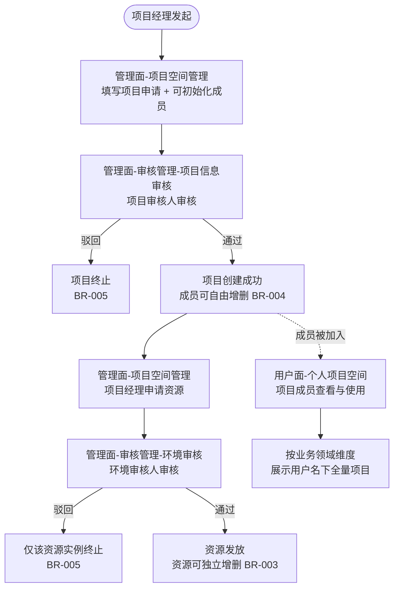

# 业务需求说明书

## 目录

1. [业务背景](#1-业务背景)
2. [业务逻辑设计](#2-业务逻辑设计)
3. [权限设计](#3-权限设计)
4. [菜单入口规划](#4-菜单入口规划)
5. [数据迁移说明](#5-数据迁移说明)
6. [验收标准](#6-验收标准)
7. [范围与假设](#7-范围与假设)
8. [附录：术语表](#8-附录术语表)

---

## 1. 业务背景

### 1.1 项目起源

平台"技术合作"用户面原本是一条端到端流程：项目申请 → 审批 → 资源发放 → 成员管理 → 交付。该流程设计通用性较强——支持 BMS / 虚拟机资源发放、OBS 文件共享配置，以及成员按权限管理，因此被反复借用于承载临时大型活动，例如其他业务临时求助的活动大赛支撑、KADC 等大型展会。

从而导致真正的技术合作项目与非技术合作项目混在同一条流程中运行，项目数据、操作日志与权限边界相互交织，难以按业务维度清晰区分。

### 1.2 痛点

| 痛点            | 表现                                        |
| ------------- | ----------------------------------------- |
| 业务数据与公共支撑能力耦合 | 公共项目/活动和技术合作项目共用数据表、审批流、权限模型。             |
| 新业务接入成本高      | 每接入一个新场景，要么复制一套流程，要么深侵入技术合作代码。复用率低，迭代互相牵制 |
| 运营负担          | 临时活动频繁借道，平台管理负担越来越重                       |
| 后续扩展性受限       | 缺一套"项目 + 成员 + 资源"的公共流程接口，新业务接入没有基线可依      |

### 1.3 业务目标

把"项目 + 成员 + 资源"三条主能力的规则、流程、权限模型从技术合作里抽出来，做成业务无感知的公共流程基线：

- 首期承载业务领域"公共项目/活动"

- 后续业务场景能基于基线快速接入，新业务接入人天 ≤ 15

本期涉及的业务领域只有两个：

| 业务领域    | 现状            | 本期处理     |
| ------- | ------------- | -------- |
| 技术合作    | 现有"技术合作"用户面   | 不动       |
| 高校科研合作  | 现有"高校科研合作"用户面 | 不动       |
| 公共项目/活动 | 借道"技术合作"用户面   | 迁至新建公共流程 |

### 1.4 成功标准

| 编号     | 指标      | 目标                                           |
| ------ | ------- | -------------------------------------------- |
| SC-001 | 业务数据隔离  | 公共项目/活动数据按 `businessDomain` 与技术合作数据隔离可查，互不串扰 |
| SC-002 | 双轨并行    | 公共流程上线后，技术合作业务流程行为与用户体验零变更、零中断               |
| SC-003 | 新业务接入效率 | 新业务接入公共流程 ≤ 15 人天                            |
| SC-004 | 公共流程标准化 | 公共流程形成稳定的接口契约与业务规则基线，可承载 ≥ 3 个后续业务场景         |
| SC-005 | 用户面统一入口 | 用户面提供"个人项目空间"统一视图，按业务领域组织                    |

## 2. 业务逻辑设计

### 2.1 业务实体与关系（仅参考）

项目是聚合根，资源和成员都挂在 `projectCode` 下。项目可独立存在，不强制拥有资源；成员初始化时不可为空（BR-004）。`businessDomain` 是隔离维度，贯穿权限过滤、用户面视图和数据迁移（见 BR-001 / BR-006 / BR-007）。

### 2.2 主干流程

### 2.3 业务规则清单

| 编号         | 规则                                                                                                                    | 触发条件               | 预期结果                                                | 异常处理                               |
| ---------- | --------------------------------------------------------------------------------------------------------------------- | ------------------ | --------------------------------------------------- | ---------------------------------- |
| **BR-001** | 管理面 4 类角色（项目经理 / 项目审核人 / 环境审核人 / 业务管理员）按业务领域作用域授权；用户面 3 类子角色（项目负责人 / 项目协管员 / 项目参与人）按单项目作用域授权；未授权作用域不可见、不可操作                                       | 用户访问任意菜单 / 接口      | 系统按用户被授权的作用域列表过滤可见项目、资源、菜单                         | 未授权作用域不展示                           |
| **BR-002** | 业务管理员在被授权业务领域内对项目拥有等同项目经理的最高权限                                                                                        | 业务管理员进入被授权业务领域     | 可对领域内任意项目进行申请、编辑、删除、增删成员、申请资源等所有项目经理操作              | 业务管理员无审核权（审核仍由项目审核人 / 环境审核人执行，职责分离） |
| **BR-003** | 资源必须挂载在项目下，一个项目可拥有多份资源；资源相互独立，可独立增删                                                                                   | 项目创建后              | 资源的申请、发放、释放均针对单一资源实例                                | 单个资源被驳回 / 释放不影响项目与其他资源             |
| **BR-004** | 3 类用户面子角色（项目负责人 / 项目协管员 / 项目参与人）在项目创建时由项目经理在管理面初始化（不可为空）；项目创建后增删支持双入口并行：①用户面：项目负责人可增删除自己外的所有成员（含设置项目协管员、添加新项目负责人）；项目协管员可增删除项目负责人和自己外的所有成员；项目参与人无管理权。②管理面：项目经理（本人申请范围）/ 业务管理员（全量）可任意增删。 | 项目创建时 / 项目存续期间 | 成员列表可任意调整；被加入成员在用户面"个人项目空间"中可见该项目                   | 删除成员时若已建立资源访问权限一并回收                |
| **BR-005** | 项目信息审核驳回 → 项目终止，不进入资源申请环节；环境审核驳回 → 仅该资源实例终止，不影响项目与其他资源                                                                | 项目审核人 / 环境审核人驳回     | 项目驳回：项目终止，无资源入口；资源驳回：仅该资源实例终止                       | 驳回后项目经理可重新发起申请                     |
| **BR-006** | 数据迁移：现有"技术合作"流程中属于"公共项目/活动"业务的项目主数据迁移至公共流程                                                                            | 上线前一次性迁移           | 迁移后技术合作流程中不再保留"公共项目/活动"类项目；用户"个人项目空间"中可正常看到迁移过来的项目  | 迁移方式、脚本、时机、回滚预案由后端 SE 设计           |
| **BR-007** | 用户面"个人项目空间"展示用户被加入的全量项目，按 `businessDomain` 维度并列展示；用户面"技术合作"、“高校科研合作”一级菜单是这份数据上对应业务领域的筛选视图；"公共项目/活动"不作为用户面一级菜单（内部运营性质） | 项目成员访问用户面          | 用户进入"个人项目空间"看到名下所有项目；通过顶部"技术合作"菜单可快速过滤到对应领域项目       | 跨业务领域项目在"个人项目空间"中以业务领域标签 / Tab 区分  |
| **BR-008** | 项目生命周期：项目有有效期；到期或业务结束后由项目经理 / 业务管理员关闭 / 归档；状态枚举沿用现有                                                                   | 项目到期 / 业务结束 / 主动关闭 | 项目置为关闭 / 归档态；其下资源按 BR-009 回收；成员在"个人项目空间"中的可见性沿用现有规则 | 沿用现有流程，本期不新增                       |
| **BR-009** | 资源释放：运行中的资源可由项目经理 / 业务管理员释放；释放针对单一资源实例，不影响项目与其他资源                                                                     | 资源不再需要 / 项目关闭      | 资源置为"已释放"态，底层资源回收                                   | 沿用现有流程，本期不新增                       |
| **BR-010** | 成员开通与唯一性：成员以手机号为唯一标识加入项目；同一手机号在同一项目内不可重复添加                                                                            | 项目负责人 / 项目协管员（用户面）/ 项目经理 / 业务管理员（管理面）新增成员   | 校验手机号唯一性后建立成员关联；被加入成员在"个人项目空间"可见该项目                 | 重复手机号：提示"成员已存在"，不重复创建              |
| **BR-011** | 容量配额：每个项目的文件存储（OBS）设有容量配额（沿用现有）；上传超额时阻止并提示                                                                            | 3 类用户面子角色上传文件         | 沿用现有流程，本期不新增                                        | 沿用现有流程，本期不新增                       |

### 2.4 边界条件与异常场景

| 场景             | 业务行为                         |
| -------------- | ---------------------------- |
| 项目经理跨业务领域申请项目  | 只能在自身被授权的业务领域内发起；目标领域未授权时403 |
| 业务管理员仅被授予单业务领域 | 仅能管理该领域内全量项目                 |

## 3. 权限设计

### 3.1 权限模型

核心模型用 **RBAC + 业务领域作用域属性**：

- 角色（Role）定义功能权限（菜单 / 操作）
- 业务领域（Business Domain）作为属性维度叠加在角色授权上
- 一个用户可被授予"角色 + 业务领域"的多重组合

数据级权限按 `businessDomain` 在查询层强制过滤。

职责分离（SOD）硬约束：

- 项目经理 ↔ 项目审核人互斥：同一项目的申请人与审核人不能为同一人
- 业务管理员无审核权

### 3.2 角色清单

| 角色      | 业务领域作用域        | 适用人群   | 核心职责                                                            |
| ------- | -------------- | ------ | --------------------------------------------------------------- |
| 项目经理    | 单 / 多业务领域（按授权） | 内部业务人员 | 在被授权业务领域内申请项目、申请资源；在管理面管理本项目成员（设定项目负责人 / 协管员）         |
| 项目审核人   | 单 / 多业务领域（按授权） | 内部业务人员 | 审核被授权业务领域内的项目                                                   |
| 环境审核人   | 单 / 多业务领域（按授权） | 内部业务人员 | 审核被授权业务领域内的资源环境                                                 |
| 业务管理员   | 单 / 多业务领域（按授权） | 内部业务人员 | 在被授权业务领域内对全量项目拥有等同项目经理的最高管理权限                             |
| 项目负责人   | 单项目（被加入即获授权）   | 外网项目成员 | 项目侧的对外责任人；用户面成员管理（可增删除自己外的所有成员，含设置项目协管员、添加新项目负责人）；一个项目可有多个 |
| 项目协管员   | 单项目（被加入即获授权）   | 外网项目成员 | 协助项目负责人；用户面成员管理（可增删除项目负责人和自己外的所有成员）                       |
| 项目参与人   | 单项目（被加入即获授权）   | 外网项目成员 | 用户面"个人项目空间"查看与使用，不参与成员管理                                |

> **关键约束（BR-001）**：管理面 4 类角色（项目经理 / 项目审核人 / 环境审核人 / 业务管理员）按业务领域作用域授权；用户面 3 类子角色（项目负责人 / 项目协管员 / 项目参与人）按单项目作用域授权。未授权作用域完全不可见、不可操作。

> **关于 3 类用户面子角色的功能差异**：与原技术合作流程一致，3 个子角色在用户面有明确的权限分层：项目负责人可管理除自己外的所有成员（含设置项目协管员、添加新项目负责人）；项目协管员可管理除项目负责人和自己外的所有成员；项目参与人仅可使用项目功能，不参与成员管理。成员管理既支持用户面自助（项目负责人 / 项目协管员），也支持管理面集中操作（项目经理 / 业务管理员），两种入口并行不冲突（详见 3.3 权限矩阵）。

> **"项目负责人"与"项目经理"辨析**：
>
> - **项目负责人**：用户面成员侧角色；外网项目成员身份；**一个项目可有多个**；在用户面对本项目成员进行管理（增删成员、设置角色）。
> - **项目经理**：管理面内部岗位；内部员工身份；每个项目 1 个；在管理面申请项目、申请资源、关闭 / 归档项目，并在管理面设置用户面项目负责人 / 协管员。
>
> 两者作用域（用户面 vs 管理面）、适用人群（外网成员 vs 内部员工）、权限边界（成员管理 vs 项目生命周期）完全不同。字面接近易混，阅读时通过"用户面 vs 管理面"维度即可区分。

> **现状角色对照与映射**（基于线上"技术合作"真实流程核对）
>
> 线上技术合作流程的角色现状——联系人 / 管理侧：项目经理、合作经理、项目专家（项目概述接口返回的三类联系人）；成员侧子角色：高校教师、高校学生、学生管理员、华为人员（新增成员时可选）。与公共流程角色模型的映射：
>
> ⚠️ 下表是基于实际观察的映射建议，业务方（技术合作运营 + 公共项目/活动运营）评审时复核。

| 现状角色     | 公共流程归属                          | 说明                                                                                              |
| -------- | ----------------------------- | ----------------------------------------------------------------------------------------------- |
| 项目经理     | 项目经理                            | 语义沿用，叠加业务领域作用域；与成员侧"项目负责人"做内/外区分（详见上文辨析）                                                 |
| 合作经理     | 项目审核人                           | "合作"剥离技术合作场景语义，正式改名为"项目审核人"                                                               |
| 项目专家     | （不纳入权限模型）                        | 现状为联系人展示属性，作为项目元数据保留（见 A-12）                                                                |
| —（新增）    | 环境审核人                            | 公共流程新增审核角色；现状环境审核职责的承接人待明确（见待澄清-7）                                                            |
| —（新增）    | 业务管理员                            | 公共流程新增领域级管理角色                                                                                  |
| 高校教师     | 项目负责人                            | 公共流程剥离"高校"措辞；项目侧的对外责任人；一个项目可有多个（见 A-11）                                                        |
| 学生管理员    | 项目协管员                            | 公共流程剥离"学生"措辞；协助项目负责人（见 A-11）                                                                  |
| 高校学生     | 项目参与人                            | 公共流程剥离"高校"措辞；用户面 read-only，不参与成员管理（见 A-11）                                                    |
| 华为人员     | （不单独映射）                          | 公共流程成员侧只保留 3 个子角色；如"华为人员"需加入项目，按"项目参与人"对待                                          |

### 3.3 权限矩阵

| 功能 \ 角色                     | 项目经理    | 项目审核人 | 环境审核人 | 业务管理员  | 项目成员（3 子角色：项目负责人 / 项目协管员 / 项目参与人） |
| --------------------------- |:-------:|:----:|:-----:|:------:|:------------------------------------------:|
| **管理面 - 项目空间管理**            |         |      |       |        |      |
| 申请项目                        | 是       | 否    | 否     | 是      | 否    |
| 管理项目（编辑 / 关闭 / 归档，BR-008）   | 是（本人申请） | 否    | 否     | 是（全量）  | 否    |
| 项目成员增删（BR-004 / BR-010）     | 是（本人申请） | 否    | 否     | 是（全量）  | 项目负责人：是（除自己外所有）/ 项目协管员：是（除项目负责人和自己外）/ 项目参与人：否    |
| 申请资源                        | 是（本人申请） | 否    | 否     | 是（全量）  | 否    |
| 管理资源（编辑 / 释放，BR-009）        | 是（本人申请） | 否    | 否     | 是（全量）  | 否    |
| **管理面 - 审核管理 / 项目信息审核**     |         |      |       |        |      |
| 查看待审项目                      | 否       | 是    | 否     | 否      | 否    |
| 审核通过 / 驳回                   | 否       | 是    | 否     | 否      | 否    |
| **管理面 - 审核管理 / 环境审核**       |         |      |       |        |      |
| 查看待审资源                      | 否       | 否    | 是     | 否      | 否    |
| 审核通过 / 驳回                   | 否       | 否    | 是     | 否      | 否    |
| **用户面 - 个人项目空间**            |         |      |       |        |      |
| 查看被加入项目                     | 否（非成员）  | 否    | 否     | 否（非成员） | 是    |
| 使用项目内资源（Web 接入 / IDE）       | 否       | 否    | 否     | 否      | 是    |
| 查看 / 下载项目文件                 | 否       | 否    | 否     | 否（非成员） | 是    |
| 上传 / 删除项目文件（受容量配额约束，BR-011） | 否       | 否    | 否     | 否（非成员） | 是    |

项目经理 / 业务管理员在被授权业务领域内拥有该领域相关功能权限；用户面 3 类子角色（项目负责人 / 项目协管员 / 项目参与人）在单项目内分别承担不同管理职能（详见 3.2 角色清单）。管理面角色（项目经理 / 项目审核人 / 环境审核人 / 业务管理员）若需访问用户面项目文件 / 资源，须以"项目成员"身份被加入该项目。

**与现状的关键差异（双入口并行）**：原技术合作流程中，成员管理主要由用户面"项目负责人"（高校教师）自助完成，管理面仅做兜底；公共流程保留并强化了这一双入口模式：用户面（项目负责人 / 项目协管员）继续承担日常成员管理，管理面（项目经理 / 业务管理员）继续承担集中式管理。两种入口产生冲突时以管理面操作为准（或以最近一次操作为准，由后端 SE 设计与业务方确认，见待澄清-10）。

### 3.4 职责分离矩阵（SOD）

| 互斥对                 | 互斥规则                               | 校验时机     |
| ------------------- | ---------------------------------- | -------- |
| 项目申请人 ↔ 项目审核人       | 同一项目的申请人与该项目的项目审核人不能为同一物理用户         | 项目提交审核时  |
| 资源申请人 ↔ 环境审核人       | 同一资源的申请人与该资源的环境审核人不能为同一物理用户        | 资源提交审核时  |
| 业务管理员 ↔ 项目审核人（同一项目）  | 业务管理员在本业务领域内无审核权（虽不直接互斥，但通过权限隔离保证） | 审核入口权限校验 |
| 业务管理员 ↔ 环境审核人（同一资源） | 同上                                 | 审核入口权限校验 |

---

## 4. 菜单入口规划

### 4.1 管理面（内网）

新增 3 个菜单：

| 菜单路径   | 菜单名              | 操作角色         | 业务领域作用域    | 聚合功能                             |
| ------ | ---------------- | ------------ | ---------- | -------------------------------- |
| 一级菜单   | 公共项目/活动 - 项目空间管理 | 项目经理 / 业务管理员 | 自身被授权的业务领域 | 项目申请 / 项目管理 / 资源申请 / 资源管理 / 成员管理 |
| 一级菜单   | 公共项目/活动 - 审核管理   | —            | —          | 父菜单                              |
| ├─ 子菜单 | · 项目信息审核         | 项目审核人        | 自身被授权的业务领域 | 项目审核（通过 / 驳回）                    |
| └─ 子菜单 | · 环境审核           | 环境审核人        | 自身被授权的业务领域 | 资源环境审核（通过 / 驳回）                  |

可见性规则：

- "项目空间管理"对项目经理 + 业务管理员可见，可见范围 = 用户被授予的角色所覆盖的业务领域
- "审核管理"对项目审核人 + 环境审核人可见，子菜单按角色过滤
- 未被授予任何相关角色的用户，看不到上述任何菜单

### 4.2 用户面（外网）

新增 1 个菜单"个人项目空间"，与已有"技术合作"、"高校科研合作"两个一级菜单并列。"个人项目空间"展示用户被加入的全量项目（含技术合作、高校科研合作、公共项目/活动三个业务领域），按 `businessDomain` 维度并列展示；"技术合作" / "高校科研合作"两个一级菜单则是这份数据上对应业务领域的筛选视图。

| 菜单路径     | 菜单名    | 操作角色      | 业务领域作用域       | 数据视图                                      |
| -------- | ------ | --------- | ------------- | ----------------------------------------- |
| 一级菜单（新增） | 个人项目空间 | 项目成员（3 子角色） | 跨业务领域（被加入的项目） | 用户名下全量项目，按 `businessDomain` 维度并列展示        |
| 一级菜单（已有） | 技术合作   | 项目成员（3 子角色） | 单业务领域（技术合作）   | 同一份项目主表上 `businessDomain = TECH_COOP` 的子集 |
| 一级菜单（已有） | 高校科研合作 | 项目成员（3 子角色） | 单业务领域（高校科研合作） | 同一份项目主表上 `businessDomain = UNIVERSITY_RESEARCH` 的子集 |

几个设计要点：

- 项目主表共用一份，`businessDomain` 字段标识业务领域归属
- 公共项目/活动不作为用户面一级菜单——内部运营性质，不对外暴露独立入口（BR-007）
- "个人项目空间"是统一聚合视图，"技术合作" / "高校科研合作"是它的业务领域筛选切片
- 个人项目空间内部布局沿用现有，本期不深化设计
- "高校科研合作"菜单已独立存在，本期不重构，仅在数据模型与视图层覆盖

### 4.3 菜单与角色映射总表

| 平台  | 菜单            | 角色            | 业务领域作用域     |
| --- | ------------- | ------------- | ----------- |
| 管理面 | 项目空间管理        | 项目经理 / 业务管理员  | 自身被授权的业务领域  |
| 管理面 | 审核管理 / 项目信息审核 | 项目审核人         | 自身被授权的业务领域  |
| 管理面 | 审核管理 / 环境审核   | 环境审核人         | 自身被授权的业务领域  |
| 用户面 | 个人项目空间（新增）    | 项目成员（3 子角色）   | 单项目（被加入）    |
| 用户面 | 技术合作（已有，不动）   | 项目成员（3 子角色）   | 单业务领域（技术合作） |
| 用户面 | 高校科研合作（已有，不动） | 项目成员（3 子角色）   | 单业务领域（高校科研合作） |

---

## 5. 数据迁移说明

### 5.1 迁移必要性

"公共项目/活动"业务长期借道"技术合作"用户面，存在历史项目数据（含已建立的项目、成员、资源关系）需要统一迁入公共流程。目的有两个：

- 公共流程上线后，"个人项目空间"中能正常展示历史项目
- 技术合作用户面不再混入"公共项目/活动"类项目，避免双轨运行期间数据重复 / 状态不一致

### 5.2 迁移范围

| 范围项    | 是否迁移 | 说明                                         |
| ------ | ---- | ------------------------------------------ |
| 项目主数据  | 是    | 现有"技术合作"流程中 `businessDomain = 公共项目/活动` 的项目 |
| 成员关系   | 是    | 项目与成员的关联关系                                 |
| 资源实例   | 是    | 已发放的资源实例及基本属性                              |
| 历史审批记录 | 否    | 仅在原系统归档，不迁入公共流程                            |
| 历史审计日志 | 否    | 同上                                         |
| 业务配置   | —    | 不涉及迁移，公共流程使用自身业务配置                         |

### 5.3 责任边界

- 业务侧（本方案）：明确迁移范围、迁移前后业务一致性预期
- 后端 SE：迁移方式（在线 / 离线 / 双写对账）、脚本设计、执行时机、回滚预案、灰度策略
- 业务方（公共项目/活动运营）：迁移前的项目清单核对与确认

### 5.4 验收要求

迁移完成后要验证：

- "个人项目空间"中迁移项目的业务领域标签 = 公共项目/活动
- 技术合作一级菜单中不再展示被迁移的项目
- 迁移项目下的成员 / 资源关系完整保留
- 迁移项目的状态、关键属性与迁移前一致

---

## 6. 验收标准

### 6.1 核心验收用例

| 编号         | 场景                  | 前置                          | 主流程                                   | 预期结果                                                           |
| ---------- | ------------------- | --------------------------- | ------------------------------------- | -------------------------------------------------------------- |
| **UC-001** | 项目经理申请项目并初始化成员      | 项目经理拥有"公共项目/活动"领域授权         | 管理面"项目空间管理" → 填写项目申请 → 初始化 2 名成员 → 提交 | 项目进入"待项目信息审核"状态；初始化成员出现在成员列表                                   |
| **UC-002** | 项目审核人审核项目（通过 / 驳回）   | UC-001 完成，项目待审              | 管理面"审核管理 / 项目信息审核" → 通过 / 驳回（带意见）     | 通过：项目变为"已创建"，可在"项目空间管理"中看到；驳回：项目变为"已终止"，无资源申请入口                |
| **UC-003** | 项目创建后增删成员（双入口）     | UC-002 通过                   | 用户面：项目负责人 / 项目协管员 → 成员管理 → 添加 / 删除；管理面：项目经理（本人申请范围）/ 业务管理员（全量）→ "项目空间管理" → 成员管理 → 添加 / 删除 | 成员列表更新；被加入成员在"个人项目空间"中可见该项目；被删除成员的"个人项目空间"中该项目消失；两种入口操作结果一致（BR-004） |
| **UC-004** | 项目经理申请资源            | UC-002 通过，项目已创建             | "项目空间管理" → 资源申请 → 填写资源信息 → 提交         | 资源进入"待环境审核"状态；项目下出现该资源条目                                       |
| **UC-005** | 环境审核人审核资源（通过 / 驳回）  | UC-004 完成，资源待审              | "审核管理 / 环境审核" → 通过 / 驳回               | 通过：资源变为"运行中"，项目下该资源可被成员使用；驳回：该资源变为"已终止"，项目及其他资源不受影响            |
| **UC-006** | 项目成员进入个人项目空间        | UC-002 通过，且当前用户为项目成员        | 用户面登录 → "个人项目空间"                      | 看到该用户被加入的所有项目（含本项目及其他业务领域项目），按业务领域标签 / Tab 区分                  |
| **UC-007** | 业务管理员对被授权业务领域全量项目管理 | 业务管理员拥有"公共项目/活动"领域授权        | "项目空间管理" → 看到该领域全量项目                  | 可对任意项目执行等同项目经理的操作（编辑 / 关闭 / 增删成员 / 申请资源 / 释放资源）；无审核权限（审核入口不可见） |
| **UC-008** | 角色未授权业务领域不可见不可操作    | 用户仅被授予"技术合作"领域，无"公共项目/活动"领域 | 尝试访问"公共项目/活动"相关菜单                     | 管理面：相关菜单完全不可见；用户面"个人项目空间"中不展示该领域项目；如尝试直接访问 URL，返回"无权限"或重定向至首页  |
| **UC-009** | 项目经理 / 业务管理员释放资源    | UC-005 通过，资源"运行中"           | "项目空间管理" → 资源管理 → 选择资源 → 释放           | 该资源置为"已释放"，项目与其他资源不受影响；成员不再可使用该资源（BR-009）                      |
| **UC-010** | 项目到期 / 关闭           | 项目"已创建 / 运行中"               | 项目经理 / 业务管理员关闭项目（或到期触发）               | 项目置为关闭 / 归档态；其下资源按 BR-009 回收（BR-008）                           |
| **UC-011** | 新增重复手机号成员           | 项目已存在，某手机号已是其成员             | 成员管理 → 新增成员 → 填入已存在手机号                | 提示"成员已存在"，不重复创建；不同手机号正常加入并开通外网访问（BR-010）                       |
| **UC-012** | 文件上传触达容量配额          | 项目 OBS 已用量接近配额              | 项目成员上传超过剩余配额的文件                       | 上传被拒绝并提示剩余 / 总配额；配额内上传正常（BR-011）                               |

### 6.2 业务验收指标

| 指标        | 目标                        | 验证方式                  |
| --------- | ------------------------- | --------------------- |
| 业务领域隔离有效率 | 100%，无跨领域数据泄露             | UC-008 验证；数据查询日志审计    |
| 双轨并行无干扰   | 100%，技术合作业务行为与用户体验零变更、零中断 | 技术合作用户面 / 管理面所有功能回归通过 |
| 数据迁移完整性   | 100%，迁移项目无丢失              | 迁移前后项目数 / 成员数 / 资源数对账 |
| 公共流程菜单可达性 | 管理面 3 入口 + 用户面 1 入口全部可达   | 角色权限矩阵遍历验证            |
| 新业务接入效率   | ≤ 15 人天                   | 下一次新业务接入时实测           |

### 6.3 需求追溯矩阵

> 满足"编号可追溯"要求（业务规则 → 用例 → 成功标准）。测试用例（TC）在详细设计 / 测试阶段补充。

| 业务规则   | 关联用例                     | 关联成功标准          |
| ------ | ------------------------ | --------------- |
| BR-001 | UC-008                   | SC-001          |
| BR-002 | UC-007                   | SC-004          |
| BR-003 | UC-004 / UC-005 / UC-009 | SC-004          |
| BR-004 | UC-001 / UC-003          | SC-004          |
| BR-005 | UC-002 / UC-005          | SC-004          |
| BR-006 | 迁移验收（5.4）                | SC-001          |
| BR-007 | UC-006                   | SC-005          |
| BR-008 | UC-010                   | SC-004          |
| BR-009 | UC-009                   | SC-004          |
| BR-010 | UC-011                   | SC-003 / SC-004 |
| BR-011 | UC-012                   | SC-001 / SC-004 |

---

## 7. 范围与假设

### 7.1 范围边界

**本期包含**

- 业务需求：业务背景、流程、规则、角色权限、菜单规划、验收
- 业务决策：明确需要数据迁移
- 业务范围：公共流程基线（项目 + 成员 + 资源）业务侧定义

**本期不包含**

| 类别         | 内容                            | 责任方             |
| ---------- | ----------------------------- | --------------- |
| 前端技术方案     | 组件 / 状态 / 路由 / 工程化            | 前端 SE / 开发      |
| 后端设计       | 后端概要 / 详细设计 / 数据库 / API 契约    | 后端 SE / 开发      |
| 隔离方案       | OBS / IAM / STS / 资源标签等具体隔离实现 | 后端 SE           |
| 迁移脚本       | 迁移脚本 / 双写对账 / 灰度策略 / 回滚预案     | 后端 SE           |
| 现有技术合作流程改造 | 技术合作用户面 / 管理面的任何代码变更          | 不涉及（双轨并行，原流程不动） |
| 现有高校科研合作流程 | 高校科研合作业务（已独立，不在本方案范围）         | 不涉及             |
| 第三方服务对接    | 短信 / 邮件 / OBS / IAM 客户端等      | 不涉及             |
| 详细状态机      | 状态枚举的细化（沿用现有）                 | 不涉及             |

### 7.2 关键假设

| #                  | 假设                                                                                   | 影响                       |
| ------------------ | ------------------------------------------------------------------------------------ | ------------------------ |
| A-1                | 管理面 4 类角色按业务领域作用域授权；用户面 3 类子角色按单项目作用域授权；通过"角色 + 作用域"二元组实现                                                   | 权限矩阵、菜单可见性、用户面数据过滤均依赖此模型 |
| A-2                | "个人项目空间"是统一聚合视图；"技术合作"是它的领域筛选切片；数据底座统一                                               | 用户面菜单规划、数据迁移范围           |
| A-3                | 公共项目/活动不设用户面一级菜单                                                                     | 用户面菜单规划                  |
| A-4                | "项目空间管理"菜单聚合项目申请 / 项目管理 / 资源申请 / 资源管理 / 成员管理 5 类操作                                   | 管理面菜单规划                  |
| A-5                | 业务管理员无审核权                                                                            | SOD 矩阵                   |
| A-6                | 数据迁移范围 = 现有"技术合作"流程中 `businessDomain = 公共项目/活动` 的项目主数据（项目 / 成员 / 资源），不含历史审批记录与历史审计日志 | 迁移范围与责任边界                |
| A-7                | 状态机沿用现有技术合作流程，本期不做状态枚举调整                                                             | 业务规则章节不展开状态细节            |
| A-8                | 成员删除时已建立的资源访问权限一并回收（具体策略由后端 SE 设计）                                                   | BR-004 异常处理              |
| A-9                | 合规要求（脱敏 / 审计日志）沿用现有，不引入新合规要求                                                         | UC-008 中隐含审计要求           |
| A-10               | `businessDomain` 字段已存在或可由后端新增                                                        | 数据底座统一的前提                |
| A-11 *(待业务方复核)*    | 公共流程将成员子角色（高校教师 / 学生管理员 / 高校学生）一一映射为 3 个公共子角色：项目负责人 / 项目协管员 / 项目参与人；原"华为人员"不再单独映射，加入项目时按"项目参与人"对待；技术合作双轨保留其原有 4 个子角色                       | 角色模型、权限矩阵、用户面展示          |
| A-12 *(待业务方复核)*    | 现状"项目专家"为联系人展示属性，不纳入公共流程权限角色（作为项目元数据保留）                                              | 角色清单                     |
| A-13 *(待业务方/后端复核)* | 项目 / 资源容量配额沿用现有，具体数值待评估（见待澄清-6）                                                      | BR-011                   |
| A-14               | 业务领域枚举（本期封闭）= `{技术合作, 高校科研合作, 公共项目/活动}`                          | 4.2 用户面菜单规划、5.2 迁移范围     |

### 7.3 待澄清遗留

1. **`businessDomain` 字段名 / 取值规范**：当前主表中是否已存在该字段？取值枚举是否标准化（`TECH_COOP` / `UNIVERSITY_RESEARCH` / `INTERNAL_EVENT`）？由后端 SE 确认。
2. **迁移执行时机**：双轨并行期间，"技术合作"流程中的存量项目是否需要双写？建议迁移完成后下掉"技术合作"流程中"公共项目/活动"类项目的入口。
3. **业务管理员的"等同项目经理"权限是否含"删除项目"**：本方案默认包含；如需限制请明确。
4. **跨业务领域项目审核人的审核列表形态**：合并视图 vs 按领域 Tab 切换（由前端决定）。
5. **SC-002"零变更"与统一数据底座的张力**：BR-007 把"技术合作"定义为同一项目主表上 `businessDomain = TECH_COOP` 的筛选视图，而 SC-002 要求技术合作流程"行为 / 用户体验零变更"。若公共流程与技术合作共用同一物理项目主表（A-10），现有技术合作查询必须新增 `businessDomain` 过滤才能避免读到"公共项目/活动"的数据。**建议**：把 SC-002 收敛为"技术合作业务行为 / 用户体验零变更"，允许为隔离目的新增最小化过滤；或由后端 SE 评估物理分表 / 独立命名空间以实现真正零侵入。Owner：后端 SE + 技术合作运营。
6. **容量配额是否按业务领域差异化**：大型活动成员数 / 数据量可能远超常规项目，现状配额具体数值需业务方 / 后端 SE 一并复核确认（A-13、BR-011）。Owner：业务方（公共项目/活动运营）+ 后端 SE。
7. **环境审核人职责承接**：现状技术合作的环境审核由谁执行？迁移到公共流程后"环境审核人"角色的实际承接人。Owner：技术合作运营 + 业务方。
8. **成员子角色映射名是否采纳**：确认公共流程将 3 个现状子角色（高校教师 / 学生管理员 / 高校学生）一一映射为"项目负责人 / 项目协管员 / 项目参与人"，并对原"华为人员"做"按项目参与人对待"的处理（A-11）是否合适。Owner：业务方。
9. **成员管理双入口冲突处理**：本方案 BR-004 / UC-003 设计为用户面（项目负责人 / 项目协管员）+ 管理面（项目经理 / 业务管理员）双入口并行；需要业务方确认：①冲突时以管理面为准 还是 以最近一次为准；②双入口是否需要在审计日志中分别记录操作来源。Owner：业务方（技术合作运营 + 公共项目/活动运营）+ 后端 SE。
10. **多项目负责人协作模型**：本方案定义一个项目可有多个项目负责人（成员列表中标记为"项目负责人"角色的所有成员），且项目负责人之间在用户面功能等价、无主次之分。需要业务方确认：①是否需要"首席负责人"概念（如资源申请 / 项目关闭需其一人审批）；②项目负责人是否可设置 / 降级其他项目负责人；③如未来要支持 PI 概念，对应的数据模型 / 权限设计如何演进。Owner：业务方（技术合作运营）+ 产品。

---

## 8. 附录：术语表

| 术语                        | 含义                                                           |
| ------------------------- | ------------------------------------------------------------ |
| 公共项目/活动                   | 本期抽取的公共流程首期承载业务，对应 `businessDomain = INTERNAL_EVENT`         |
| 业务领域（Business Domain）     | 标识项目所属业务归属的维度属性，所有角色权限、项目可见性均按此维度隔离；本期枚举 = `{技术合作, 高校科研合作, 公共项目/活动}` |
| 项目成员（成员侧角色统称）         | 用户面 3 个子角色的统称：项目负责人 / 项目协管员 / 项目参与人；作用域 = 单项目                              |
| 项目负责人                     | 成员侧 3 个子角色之一；项目侧的对外责任人；公共流程下原"高校教师"的对应角色；一个项目可有多个                        |
| 项目协管员                     | 成员侧 3 个子角色之一；协助项目负责人；公共流程下原"学生管理员"的对应角色                                      |
| 项目参与人                     | 成员侧 3 个子角色之一；用户面 read-only；公共流程下原"高校学生"的对应角色                                |
| 技术合作                      | 现有技术合作用户面所承载的生态对外合作业务，双轨并行期间保持不变                             |
| 高校科研合作                    | 现有"高校科研合作"用户面所承载的业务，现状已独立为一级菜单，本期流程不动                   |
| 公共流程                      | 本期从技术合作业务中抽离出来的"项目 + 成员 + 资源"标准流程基线，业务无感知                    |
| 用户面                       | 面向外网项目成员的平台（独立代码仓、独立域名、独立入口）                                 |
| 管理面                       | 面向内部业务人员（项目经理 / 项目审核人 / 环境审核人 / 业务管理员）的平台（独立代码仓、独立域名、独立入口）    |
| 双轨并行                      | 公共流程与现有技术合作业务流程同时运行、互不影响                                     |
| 个人项目空间                    | 用户面新增的一级菜单，展示用户被加入的全量项目，按业务领域维度组织                            |
| `businessDomain`          | 标识项目业务归属的字段，取值如 `TECH_COOP`（技术合作）、`UNIVERSITY_RESEARCH`（高校科研合作）、`INTERNAL_EVENT`（公共项目/活动） |
| SOD（Separation of Duties） | 职责分离，体现为申请人与审核人不能为同一物理用户                                     |

---

## 评审与变更记录

| 版本   | 日期         | 修订人       | 修订内容                                                                                                                                                                                                                                                                              |
| ---- | ---------- | --------- | --------------------------------------------------------------------------------------------------------------------------------------------------------------------------------------------------------------------------------------------------------------------------------- |
| v1.0 | 2026-06-05 | —         | 初版，业务评审稿                                                                                                                                                                                                                                                                          |
| v1.1 | 2026-06-05 | Claude 辅助 | 基于线上真实流程核对修订：精化 SC-001 隔离下限；新增 BR-008~011；新增 2.5 状态机、2.6 业务量级与非功能；补充 3.2 现状角色对照与映射；新增 UC-009~012 与 6.3 需求追溯矩阵；补充 A-11~13 与待澄清 5~8                                                                                                                                                 |
| v1.2 | 2026-06-05 | Claude 辅助 | 文档质量与权限完备性修订：2.1 实体关系图由 ASCII 改为 Mermaid ER 图；3.3 权限矩阵新增"文件查看/下载、上传/删除"行；补充"成员管理位置（自助 vs 集中）"与现状差异说明及待澄清-9                                                                                                                                                                        |
| v1.3 | 2026-06-05 | —         | 基于用户评审反馈修订：回退 SC-001 中隔离实现细节；删除 2.5 状态机、2.6 业务量级；BR-008~011 标注"待业务方/后端复核"；3.2 现状角色对照表、A-11/A-12 标注"待业务方复核"；A-13 移除具体配额数字、标注"待业务方/后端复核"；待澄清-6 补充配额数字复核备注                                                                                                                           |
| v1.4 | 2026-06-05 | —         | 修正项目背景理解 + 语言润色：重写 1.1，明确"技术合作"主业与"公共项目/活动"借用的关系；业务领域枚举明确为 3 个（技术合作 / 高校科研合作 / 公共项目/活动），高校科研合作本方案不涉及；1.3 新增业务领域枚举表；4.2 / 4.3 增补"高校科研合作"用户面菜单行（仅为完整性，本方案不动）；BR-007 更新为 3 业务领域版本；A-2 / A-6 收窄为公共项目/活动；5.2 增加"范围澄清"段；7.1 新增"现有高校科研合作流程"为不包含项；7.2 新增 A-14 业务领域枚举封闭假设；全文语言润色，减少 AI 味套话 |
| v1.5 | 2026-06-09 | —         | 业务领域枚举收敛为 2 个（技术合作 / 公共项目/活动）；4.2 / 4.3 删去"高校科研合作"用户面菜单行（移至 4.2 末尾说明，已是独立一级菜单，与本方案无关）；BR-007、A-2、A-6、A-14、术语表 enum 同步收敛；1.1 关于高校科研合作的说明改为"不展开"口吻；7.1 保留"现有高校科研合作流程"为不包含项；7.3 待澄清 1 去掉 `UNIVERSITY_RESEARCH`；全文语言进一步润色                                                             |
| v1.6 | 2026-06-09 | — | 修正 1.1 措辞失真：①恢复"真正的技术合作项目"与"借来的活动项目"并列主语结构；②补回"完全分不开"的程度副词；③回正 1.1 第一段口语化简写（"它搭得比较通用"→"该流程设计通用性较强"、"成员按权限管"→"成员按权限管理"）；④5.1 标题"为什么要迁移"回正为规范用语"迁移必要性"                                                                                                                              |
| v1.7 | 2026-06-09 | — | 同步用户 1.x-3.1 修订到后续章节：①业务领域枚举回到 3 个（高校科研合作重新进入，作为"不动"的对等条目）；②BR-004 改为"初始化不可为空"，同步修正 2.1 ER 图注释与图后说明；③BR-007 重写后明确"技术合作"、"高校科研合作"都是用户面筛选视图，4.2 / 4.3 补全高校科研合作菜单行，删去冗余的"关于高校科研合作菜单"旁注；④A-14、待澄清 1、术语表 enum、`businessDomain` 取值示例、术语表"高校科研合作"词条全部同步收敛为 3 业务领域 |
| v1.8 | 2026-06-09 | — | 处理 3.2 TODO（成员子角色迁移映射 + 内部角色改名评估）：①3.2 角色清单将原"项目成员"1 行扩展为 4 个子角色（项目负责人 / 项目协管员 / 项目参与人 / 项目内部成员），一一映射自现状的 4 个成员子角色（高校教师 / 学生管理员 / 高校学生 / 华为人员），剥离业务领域与公司属性措辞；②3.2 新增关于"4 子角色功能差异"说明：本方案已上收成员管理，4 子角色在用户面功能等价；③3.2 现状角色映射表展开 4 行，"合作经理"标注建议改名为"项目审核人"，"项目经理"标注为保留；④BR-001、BR-004、BR-011、A-1、A-11、2.1 ER 图 MEMBER.role、3.3 矩阵列头、3.3 后置说明、4.3 角色列、术语表同步更新；⑤7.3 待澄清新增 3 项（子角色映射名、合作经理改名、是否恢复 4 子角色功能差异），原 8 / 9 项相应更新与顺延 |
| v1.9 | 2026-06-09 | — | 处理 3.2 角色映射的 3 个用户决策：①"合作经理"正式改名为"项目审核人"，全文替换 17 处（2.2 主干流程、2.3 BR-002/BR-005、3.1 SOD、3.2 角色清单、3.2 现状角色映射、3.3 矩阵列头、3.3 后置说明、3.4 SOD、4.1 菜单表与可见性、4.3 映射、6.1 UC-002、7.3 待澄清-4、8 术语表"管理面"）；②恢复用户面成员管理权（撤销 v1.8 的"上收"假设）：BR-004 改写为双入口并行（用户面项目负责人/项目协管员 + 管理面项目经理/业务管理员），BR-010 触发条件更新，3.2 关于子角色功能差异说明重写，3.3 矩阵"项目成员增删"行展示 3 子角色的不同权限，3.3 "与现状的关键差异"由"成员管理位置"改为"双入口并行"，6.1 UC-003 改写为双入口；③"项目内部成员"映射删除，3.2 角色清单 4 行收敛为 3 行（项目负责人 / 项目协管员 / 项目参与人），现状角色映射中"华为人员"标注为"不单独映射，按项目参与人对待"，BR-001 / BR-011 / A-1 / A-11 / 2.1 ER 图 / 4.2 / 4.3 / 8 术语表全部同步；④3.2 新增"项目负责人 vs 项目经理"辨析段，8 术语表"项目负责人"词条加"一个项目可有多个"；⑤7.3 待澄清删除"合作经理改名"项（已决定），删除"是否在用户面恢复 4 子角色功能差异"项（基于已撤销的"上收"假设），新增"双入口冲突处理"与"多项目负责人协作模型" 2 项 |

> **下一步建议**：
> 
> 1. 业务方（公共项目/活动运营 + 技术合作运营）评审本需求
> 2. 评审通过后，移交后端 SE 启动后端概要 / 详细设计与迁移方案设计
> 3. 前端 SE 启动前端技术方案（用户面 + 管理面菜单接入方案）
